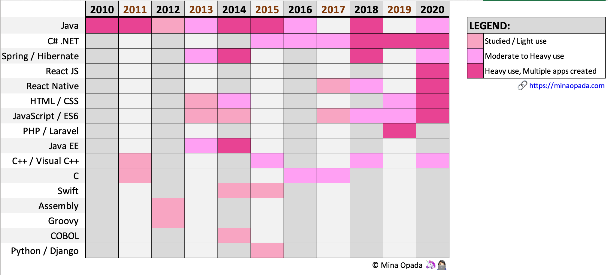
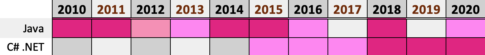
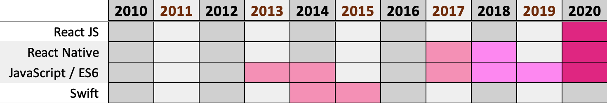
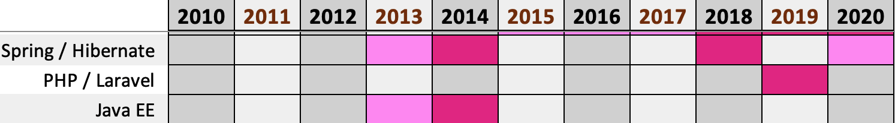

How to use being the 'jack of all trades, master of a few' to your advantage.

Are you a jack of all trades, but a master of none? Do you jump from one programming language to another? That's not necessarily a bad thing.

One of the most common pieces of advice for success in programming is to focus on one language, that is, **one set of complementary technologies**.

Star Trek quote from [GIPHY](https://giphy.com/)

For example, the knowledge and mastery of the Tech Stack below should be mutually exclusive.

1.  **Stack 1**: HTML, CSS, JavaScript, React, Node JS
2.  **Stack 2**: HTML, CSS, React, PHP, Laravel
3.  **Stack 3**: HTML, CSS, JSP, JavaEE, Spring, Hibernate

I do agree with it, so much so that I was concerned with my trajectory. There _is_ merit to this level of concentration: **you will gain mastery of the language**. However, there are also benefits to defying this advice.

**I use at least three programming languages in a week for different projects. As a jack of all trades, master of a few 🦄, I saw the value of being a generalist and how to use it to my advantage.**

## Developer Journey 👩🏻‍💻

First, a bit of context. **I have been coding for a little over ten years now** 🙈, half of those in the Tech industry.

In those years, I have:

- Coded in over **17** scripting and programming languages
- Learned over **5** frameworks
- Developed > **30** personal and professional products (some, I mentioned [here](http://minaopada.com/keeping-sane-daily-doses-of-productivity/)), > **25** of those were created from the ground up.

Here's a handy depiction of my journey as a developer over the years.

Programming Languages I've learned and used over the

You can see that in the past 5 years, I've used multiple languages each year. I've never really focused on just one thing.

In the past, [I was insecure about this](https://dev.to/defgrav04/always-a-beginner-jumping-from-one-programming-language-to-another-3h19). It is only until recently that I found the value of wearing multiple hats.

## Here's why it's awesome 😎 and advantageous 📈 to be the jack of all trades, master of a few

### #1: It facilitates learning new programming languages

Most programming languages closely resemble one another. They only differ in syntax, but the basic concepts are there. It's largely similar to spoken languages, the words differ but they share the same components — grammar, parts of speech i.e. noun, verb, adjective, etc.

Here's how I transitioned from one programming language to another.

#### Java → C# .NET

Learning across OOP languages

- I had to dive into C# when I started working in 2015. Because I had a wealth of experience in Java, the transition was a breeze, and the learning curve wasn't steep. 💁🏻‍♀️

#### JavaScript → Swift → React Native / ES6 → React JS

Web and Mobile Development Transition

- **JS → Swift**. I learned JS in our Web Development class in college. This helped me gain enough confidence to purchased classes on [Udemy](http://udemy.com/), where I learned Swift.
- **Swift → React Native / ES6**. Because I know Swift (only for iOS), it motivated me to learn React Native for cross-platform mobile development. RN wasn't available when I took an interest in mobile development.
- **React Native → React JS**. Knowing React Native made learning React JS incredibly simple. Seriously, I learned React JS in a day, learned by doing.

#### Java EE, Spring, Hibernate → PHP, Laravel

Backend Development Transition

- I learned PHP in just one day, thanks to [Codecademy](http://codecademy.com/learn) and my background in various programming languages.
- It's challenging to learn and adjust to new frameworks and Tech Stacks. Fortunately, PHP + Laravel was _slightly_ similar to the projects I have done in the past with JavaEE + Sprint + Hibernate. So, it only took me less than a week to get comfortable.

### #2: It increases your problem-solving capacity as you transcend language limitations

Every language has its limitation. For languages of the same type, there's at least one workflow or process that one does better, or another doesn't support.

**Think outside the box.** Knowing multiple programming languages means you won't be restricted to the capacity and limitations of one language. General knowledge allows you to think more deeply about problems.

### #3: It helps you become a more versatile developer

With the breadth of knowledge, **you can identify the best, most appropriate technological solutions** on an architectural level to a variety of business problems. If you only know one, say, Java, your solutions will be limited solely for the problems the language can solve.

For example, you can easily identify the most effective Tech Stack to address the business problem in an efficient, robust, cost-effective, and scalable manner.

Last year, I was involved in [AutoServed](https://autoserved.io), a local Automotive startup.

- Only three of us developed the website. We had to determine the best Tech Stack to use.
- **✅ Requirement**: Create a Minimum Viable Product (MVP). 😎 Meaning, we should create the product with only the core features as fast as possible.
- **😓Dilemma**: I was the Project Manager and Back-end Developer for the project. Planning and organizing were second nature to me, but my back-end skills were limited to Enterprise programming (JavaEE).
- 🏆**Solution**: Use the Tech Stack that's easy to set up and code. This is where point 1 above came in handy. I had to learn PHP and Laravel — fast! And I did! 🎉

**Instead of just sticking to what I know** (JavaEE tech stack), which takes time to set up and even more time to code, **I adapted to the demands of the project and learned a new language so we can achieve our goals**. When you know more technologies and the nuances between them, you can deliver results in the smartest way possible.

## #4: It makes it easier to adapt to changing technologies

More programming languages emerge every couple of years, each with its unfair advantage. The new ones are becoming more powerful, accessible, learnable, and readable each year.

A good example is the **rapid progress of mobile 📱development** over the past couple of years. In 2014, my only options were Objective-C for iOS (too complicated) or Java for Android (environmental difficulties). Swift was pretty new at that time, so people were careful and doubtful — but I went for it anyway.

A few years later, cross-platform tools emerged, enabling developers to code both Apple and Android apps with one codebase, requiring only minimal modifications. Now, it has become widely popular, with React Native, Xamarin, and Unity among the most well-known.

If I adhered to Swift, I wouldn't be able to program Android apps with more flexibility and less code repetition. Nor would I discover the remarkable online community of React and React Native!

## Although, there is a downside...

If you want a higher position, companies prefer mastery of certain technologies over well-roundedness. In short, they prefer people who specialists over generalists who are spread too thin.

### The Silver Lining

If you're not too particular about climbing the corporate ladder, **there's a multitude of job opportunities available**. At this age of information, programming skills are in high demand. Even the pandemic does not deter the need for developers and designers. So, you can afford to be particular!

## Final Thoughts

Don't worry too much or feel insecure about your development skills. **Every developer has her own journey**. When in doubt, remember **_why_** you code — for the challenge, the satisfaction of creating, for the sheer thrill of it.

**My advice, become a generalist first, and then a specialist.** Explore as many programming languages you fancy. Try playing the field first. Once you found your calling, **stick to it**. Master the craft, learn the different flavors.

That's why it's great to be the jack of all trades, master of a few. You will have breadth _and_ depth. 😉

> "I'm not a great programmer; I'm just a good programmer with great
> habits."  
> ― Kent Beck
