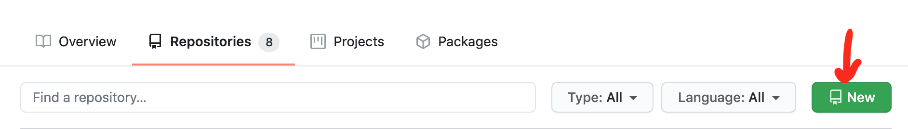
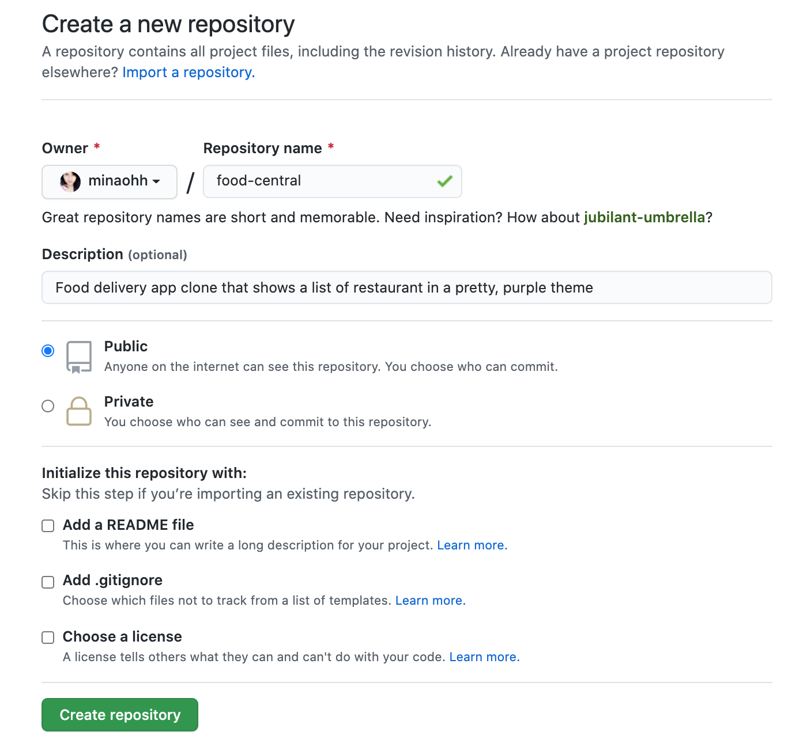
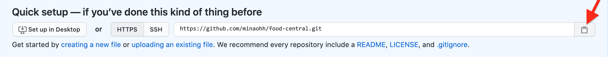
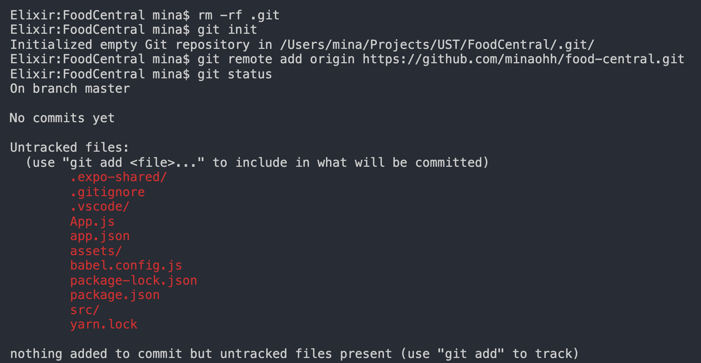
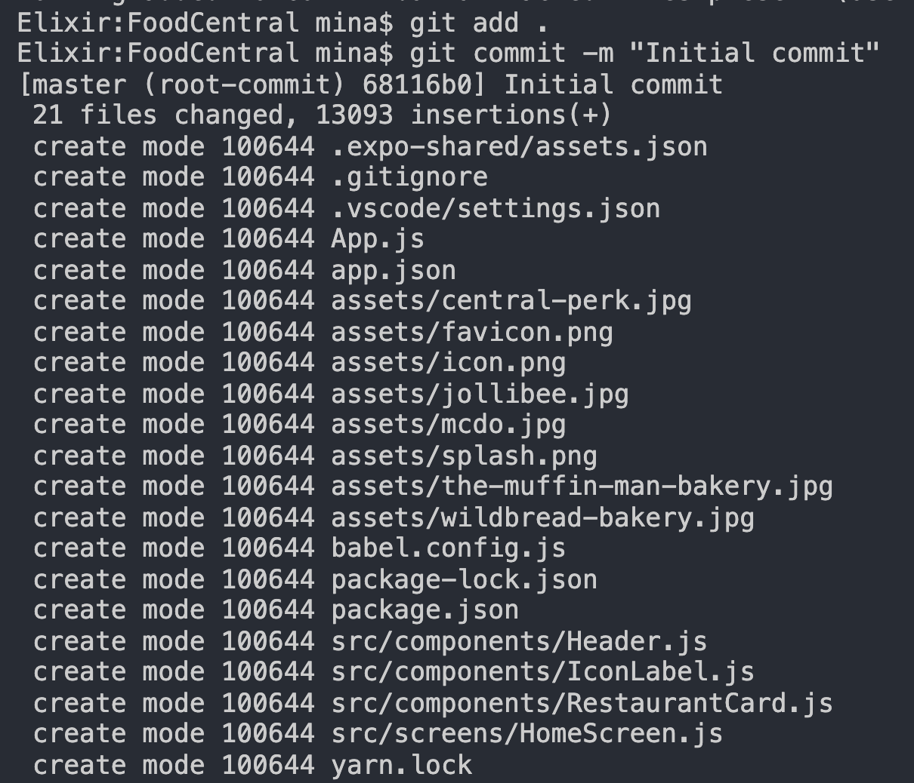
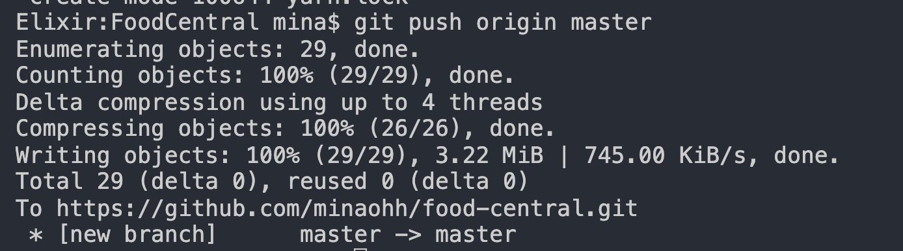

For Software Developers and Designers, creating repositories on [Github](http://github.com/) is one of the best ways to create a portfolio and showcase your skills.

Creating a portfolio is important to build your career and demonstrate your competencies. **It allows you to show people what you can do**, which is a stronger testament to your expertise than reading about it in resumes or reading about it in interviews.

  

  It's never too late, but you have to start NOW.

Build your portfolio as early as you can and work on it as much as you can. This will allow you to stay ahead of the competition.

## Create a Github Repository

Here are the steps to create a Github repository.

1. Go to your profile. The link is usually `github.com/<your_username>`
2. Select the '`Repositories`' tab
3. On the upper-right corner, click the '`New`' button.

   
   New Repository Button

   Create a new repository by clicking the 'New' button

   - Alternatively, you can create a new repository by visiting the link: [github.com/new](https://github.com/new). As long as you are logged in, it will automatically redirect you to the '`Create a new repository`' form.

4. Fill-up the details and click the '`Create Repository`' button once you are done.

   - Opt not to add a README file yet, we can add that later

   
   New Repository Form

That's it! Now that you've created a Github repository, it's time to wire your project to it!

## Wiring your project code to your Github Repository

Here, we tell Github which of our projects will use that repository.

1. Go to Visual Studio Code terminal or the command prompt, and go to the directory of your selected project.
   - To illustrate, I'm going to upload a `React Native` project called `FoodCentral` onto my Github account.
2. On Github, copy the repository link.

   
   Clone Repository

3. Then, switch back over to the terminal and write the following commands briefly explained below.

   - `rm -rf .git` - Removes all git instances in the project
   - `git init` - Initializes an empty repository in the project
   - `git remote add origin <repository_link>` - Clones the repository. Paste the link of the repository you copied here.
   - `git status` - Displays the state of the working directory, showing the files for staging.
   - `git add .` - Adds the changes in the current working directory to the staging area. Here's more information on [git add](https://www.atlassian.com/git/tutorials/saving-changes).
   - `git commit -m "Add commit message here"` - Captures a snapshot of the staged changes. Here's more information on [git commit](https://www.atlassian.com/git/tutorials/saving-changes/git-commit).
   - `git push` or `git push origin master` - This allows you to transfer your local changes to the remote repository. Here's more information on [git push](https://www.atlassian.com/git/tutorials/syncing/git-push).

   When you run all the commands above, you'll get the following results.

   
   Clone Repository

   
   Staging Changes

   
   Upload changes to remote repo

And voila! Your changes are in the remote repository. You may checkout the [food-central repository here](https://github.com/minaohh/food-central).

## Putting it all together

Github is a form of [Virtual Control System](https://www.atlassian.com/git/tutorials/what-is-version-control) that manages changes to your files (like source code) over time. In this way, you can keep track of incremental changes you have to your source code, and easily revert to a previous state of your code.

To do this, you will have to utilize the commands below repeatedly throughout development.

1. `git status`
   - Displays the state of your current working directory. It will show you which files are added, deleted, and modified.
   - This step is not necessarily required, but it's best to review the files first before staging.
2. `git add .`
   - Note that the dot (`.`) here means "everything in this directory"
   - If you want to commit changes to a specific file, you have to add the path to that file instead of the dot.
3. `git commit`

   - The message (`-m "Custom message string"`) is optional. However, it's good practice to add a message to your commits briefly specifying the changes of that specific version of your code.

4. `git pull`

   - This command is used to download changes from the remote repository to your local or working directory. Here's more information on [git pull](https://www.atlassian.com/git/tutorials/syncing/git-pull)
   - It is required to synchronize your changes first before pushing files to the remote repo.
   - In the scenario above, there are no changes to fetch from our repository, hence, this command is not necessary on uploading initial commits.

5. `git push` or `git push origin master`
   - Uploads files to the remote repository

Congratulations! You are now on your way to tracking meaningful changes to your code and building your own portfolio!
