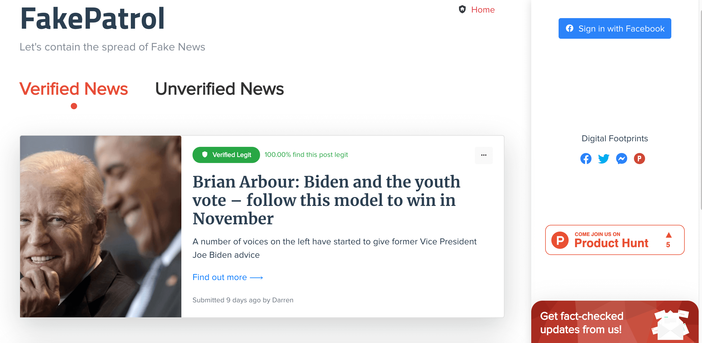
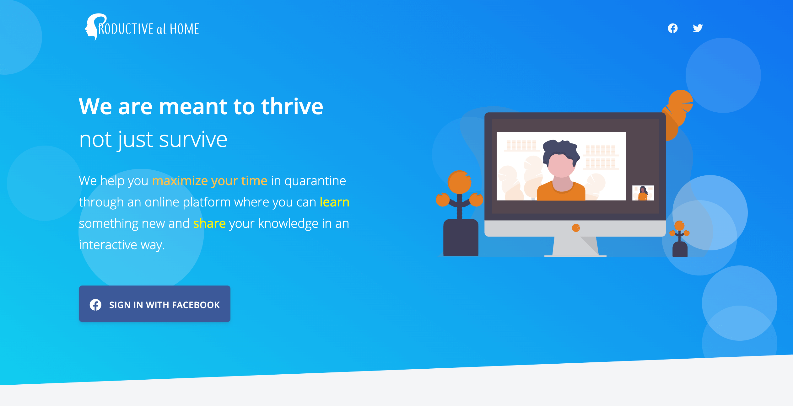
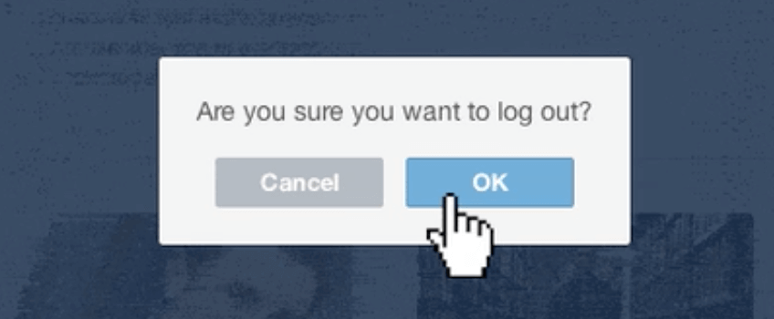
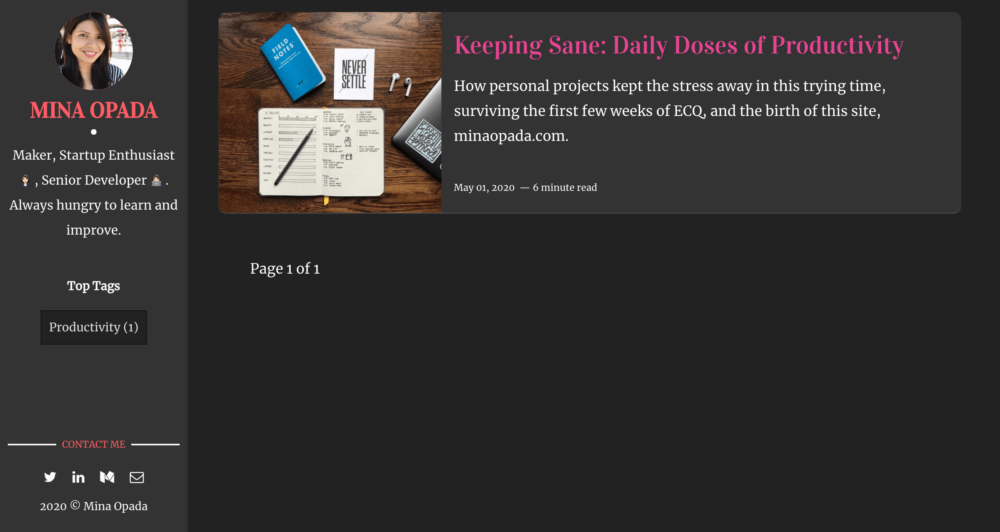

How personal projects kept the stress away in this trying time

No one could have ever predicted that their lives will be turned upside down in 2020. Now, everything is on pause.

As a _self-proclaimed_ control freak who has a plan or a list for every hour of
her life, **I see canceled plans at this scale as a major pain point.** Of course, there is more to this crisis than the disruption of the old “normal”,
but I won’t get into anything morbid or depressing here — we’ve had enough of
that.

Everyone deals with stress differently. Some signed up on _TikTok_, or scrolled
endlessly on social media, or binged watched (i.e. KDramas) on streaming
platforms.

**I buried myself in personal projects**. 👩🏻‍💻 **It was only when I stopped
working that I felt the pang of sadness**, which is perfectly normal when in
crisis mode.

So, in the first month of the [Enhanced Community Quarantine (ECQ) in the
Philippines](https://en.wikipedia.org/wiki/2020_Luzon_enhanced_community_quarantine)
🇵🇭, both [my partner](https://arjayosma.com) and I created the following products, keeping our minds
preoccupied, and our days consistently productive.

Here's what we worked on.

## Project #1: Fakepatrol.app ✅

[Fakepatrol.app](http://fakepatrol.app) website

[Fake Patrol](http://localhost:8000/keeping-sane-daily-doses-of-productivity/fakepatrol.app), my partner's passion project, was the first project we worked on during the ECQ. It's a website that **helps users determine whether or not an article or post is fake**. We created it as part of [#HackPHQuarantine](https://www.hackph.tech/), a hackathon in the Philippines, but until now, we haven't heard from them 😂. But that's okay, we didn't do it just for the hackathon.

Initially, FakePatrol was intended to be a mobile app. However, Google Play hasn't approved it yet (it's been three weeks). Hence, we created the website to process requests in the meantime.

The road isn't without hiccups, but we got through it. And, we launched the product on [ProductHunt](https://www.producthunt.com/posts/fakepatrol). 😉

## Project #2: ProductiveAtHome.club 🧠

[ProductiveAtHome.club](http://productiveathome.club) Landing Page

[ProductiveAtHome](http://productiveathome.club) 🧠 is my passion project. It's **a platform where people can share their
knowledge and learn something new interactively for free**. I’ve
had this idea since late last year, so I was ecstatic.

We launched 🚀 the site last April 16, in time for [ProductHunt’s
Makers Festival (WFH)](https://www.producthunt.com/makers-festival/wfh), and
[posted on ProductHunt](https://www.producthunt.com/posts/productive-at-home)
last April 19.

ProductiveAtHome on ProductHunt’s [Makers
Festival](https://www.producthunt.com/makers-festival/wfh/voting)

😂 Funny story: I posted the wrong link on my submission for PH’s _Makers
Festival_. If you look for [ProductiveAtHome](http://productiveathome.club)
[here](https://www.producthunt.com/makers-festival/wfh/voting) and click on the
link, it will show nothing because of a typo 😅 on the link. There’s a ‘_t_’
before “https”. 🤦‍♀️

I was so excited to launch [ProductiveAtHome](http://productiveathome.club) 🧠,
to share “my baby” to the world, I couldn’t sleep. That excitement and determination helped me see
this project through to completion.

## How working on personal projects helped kept me sane

Remember when I said I felt the _pang of sadness_? Well, the week after releasing those products, I was on strict hiatus. **I permitted myself to relax**, meaning, after-work activities should _not_ entail making products.

A couple of days in, I felt _melancholy_, but I couldn't understand it at first. The reality of the lack of normalcy, the isolation, they're finally dawning on me.

Eventually, I learned to deal with those feelings, realizing that **ironically,** **the relaxation time wasn't good for me**. I was better off building the next website or app. **Keeping busy was keeping me sane.** 👩🏻‍💻

**Focus!** (Photo by [Kevin Ku](https://unsplash.com/@ikukevk) on
[Unsplash](https://unsplash.com))

Here's how my personal projects helped keep my sanity and positivity intact.

### #1: Working on them meant I was offline most of the time. This kept the negativity away 💁🏻‍♀️

Living life unplugged

Keen to launch as soon as possible, we had to work for two weeks straight on top of our day jobs. We didn’t have time to scroll mindlessly on social media, where stress and negativity thrived. We had to _disconnect_.

**Out of sight, out of mind.** With this form of detachment, I only allowed myself a 15-minute-maximum online time to check COVID stats and skim current events. The rest, I deemed as mere unnecessary distractions from the goal — product launch 🚀.

Sometimes, ignorance is bliss. And that’s okay. **It’s always okay to protect your mental health.**

### #2: To “begin with the end in mind” is to leave little room for distractions 🙈

Photo by [Ian
Schneider](https://unsplash.com/@goian) on
[Unsplash](https://unsplash.com)

On top of disconnecting from social media, we limited our time on streaming
platforms, too.

**When you are so focused on your goals, you will do everything in
your power to achieve them**. So, eliminating these distractions weren’t
difficult.

We are so keen to launch, we did nothing else but code. Other than completing the project, we didn’t give anything else the time of day.

### #3: Hitting milestones and building products meant ending each day satisfied 😌

My productivity loop

There is no doubt that [happiness affects
productivity](https://www.knowmail.me/blog/productivity-affect-happiness/). And I was in a productive loop: Eat, sleep, code.

I had a list for everything — modules, marketing, bugs, plus a daily to-do list. On most days, I feel accomplished and satisfied as I tick _everything_ on the list. **That sense of achievement kept me happy and motivated me to keep working.** Thus, reinforcing points 1 and 2 above.

## Moving Forward

It's clear to me that on top of additional activities like talking with friends & family, pampering myself and the like, **my true calling is creating more products, doing more work _precisely_ because it doesn't feel like work.**

And so, I've decided to finally set up a **blog for Tech, Business, and Professional Development**, and buying a domain with my name on it.

Now here we are...

[minaopada.com](https://minaopada.com) we see today

## Conclusion

Throughout the first month of the ECQ, I kept myself busy 🐝 by devoting most of
my time to developing products. Such tenacity and determination gave birth to 2
products: [ProductiveAtHome](http://productiveathome.club) and
[FakePatrol](http://fakepatrol.app).

> The products themselves were a constructive distraction from the harsh reality
> that nothing will ever be the same again — this is the new “normal”.

My next _personal_ project is now adding more relevant content to this blog. 🤓

### Find your own “sanity project”

**A _sanity project_ is any activity that helps you keep your sanity.** Don't bother googling. I made it up 😜.

**The best way for all of us to cope with the global crisis that is COVID-19 is to keep busy**
— sign up for classes, host video calls, talk to your friends and
family, minimize your time on social media, dance on TikTok, watch movies &
series, volunteer, donate (time or money, you choose), exercise, do yoga, etc. Balance the productivity 💪🏼 and relaxation 🛀🏻

**My personal projects are what kept me sane and happy.** I urge you start one. 😉

1.  Do something productive ✅ every day, but always leave room for downtimes.
1.  Don’t try to do everything at once. 🏋🏻‍♂️💃🏻📚🏓🎹🎨🎸🎮
1.  Focus 👁 on one thing at a time.
1.  Most importantly, don't force yourself. Do something you enjoy and it will be a breeze 💨.

**Keep sane and stay at home. I know we will get through this**, we just have to
be patient. 😊

 
 
 

---

[ProductiveAtHome.club](http://productiveathome.club) is a productivity site I
started with my partner under our startup, [SevTech,
Inc](http://twitter.com/sevtechinc). Sign up on the
[site](http://bit.ly/productiveathomeclub)! You can also connect with us on
[Facebook](http://fb.com/productiveathome),
[Twitter](http://twitter.com/prodathome),
[ProductHunt](https://www.producthunt.com/posts/productive-at-home).
  
[FakePatrol.app](http://fakepatrol.app) is a mobile app (_pending approval_)
turned [website](https://fakepatrolapp.carrd.co/) my partner started with myself
under our startup, [SevTech, Inc](http://twitter.com/sevtechinc). Sign up on the
[site](http://fakepatrol.carrd.co)! You can also connect with us on
[Facebook](http://fb.com/fakepatrolapp),
[Twitter](http://twitter.com/fakepatrolapp),
[ProductHunt](https://www.producthunt.com/posts/fakepatrol).

