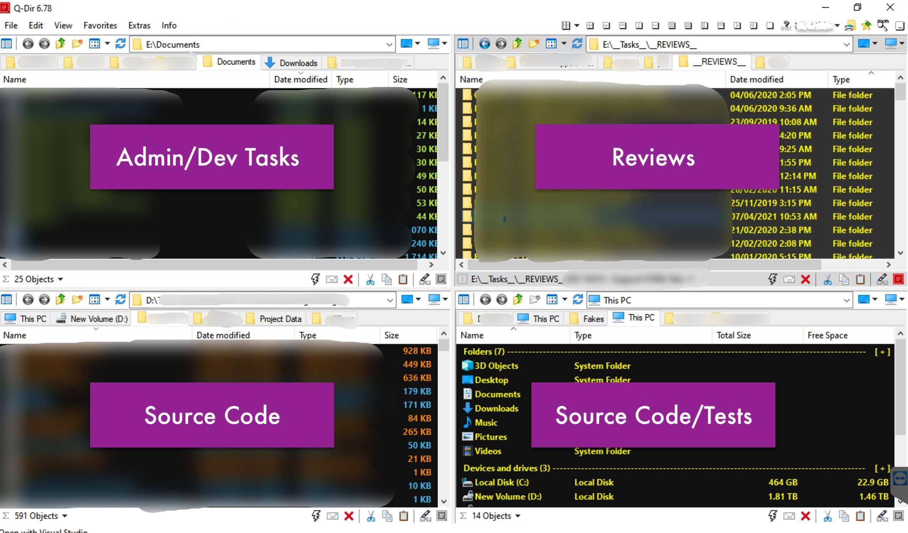
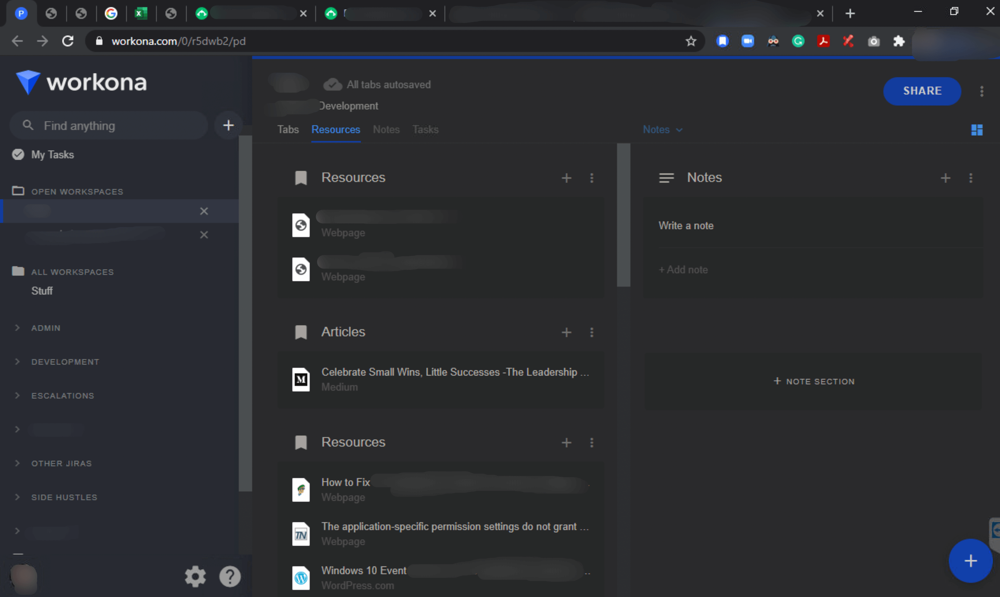
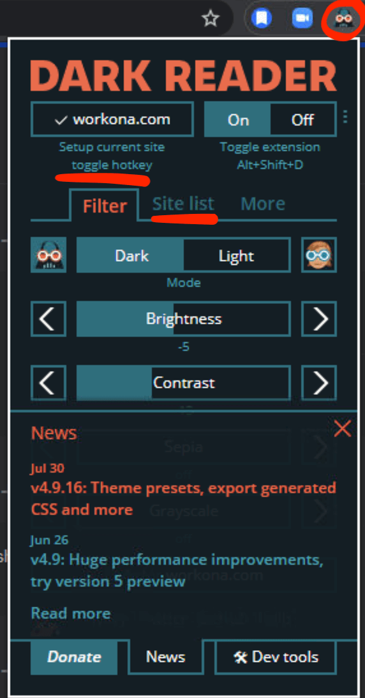
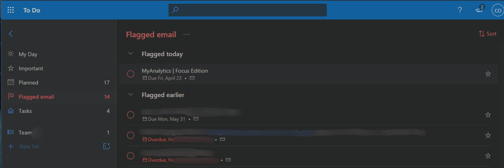
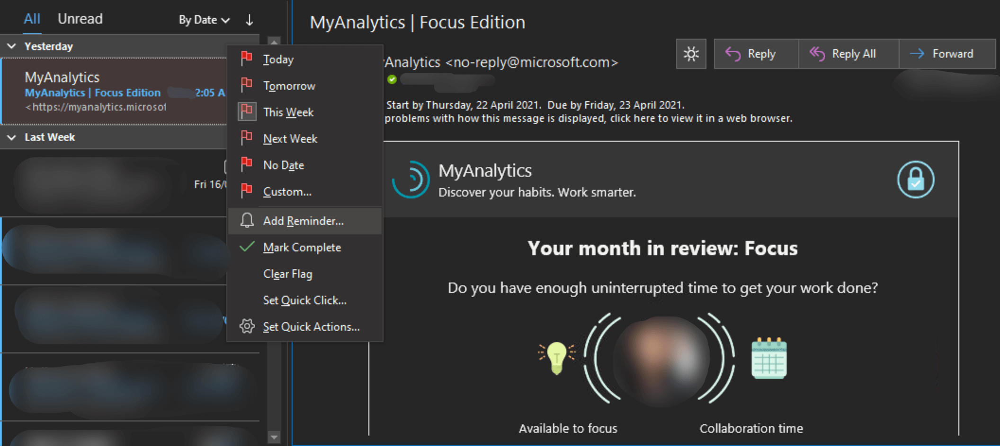
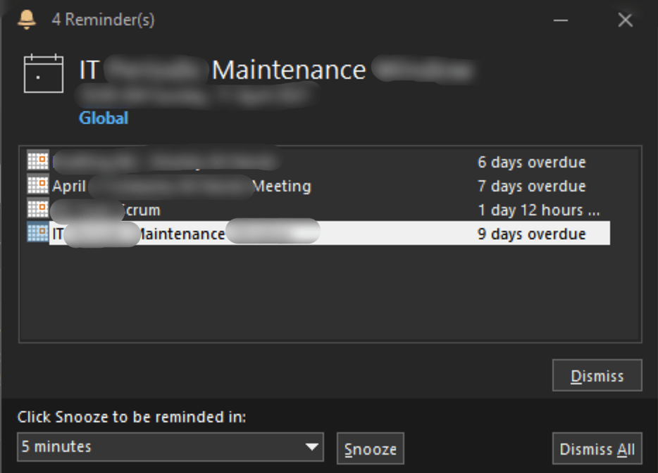

All over the world, we are encouraged to “work smart, not work hard”, to be more proactive in coming up with ways we can be more effective and efficient. This is why there are so many productivity tools available to ensure you do just that.

This article intends to help you navigate through the noise and find out what works for you. So here are software tools I use everyday that increases my productivity at work.

---

## Q-Dir

_How I use Q-Dir at work_

**[Quad-Directory](http://www.softwareok.com/?seite=Freeware/Q-Dir) or Q-Dir allows you to explore at least four directories at the same time. This is an alternative to Windows Explorer.**

I have been using Q-Dir on Windows since 2015, and it has never failed me.

Download Q-Dir [here](http://www.softwareok.com/?seite=Freeware/Q-Dir). Note that this productivity app only runs on Windows OS.

### Why use it

Not only does Q-Dir allow you to have 4 file explorers neatly divided on the screen, but it also allows for tabbed directories just like Finder on a Mac.

As a software developer, I found this is perfect for me as I have to deal with multiple directories at the same time: source code, executable files, client files, files for review, patches, notes, etc. Each has its own directory.

Whenever I have remote sessions with my teammates, they have at least 4 File Explorers open. Switching between them and remembering the order of the directories entails a slight overhead that can be mentally taxing at times.

### How to use

This my system for using this tool more effectively. I assigned specific directories to each quadrant and stick by them.

- 1st quadrant — code review files (patches and notes), logs, and vendor documents
- 2nd quadrant — current tasks assigned to me (at least 1 tab per task).
- 3rd quadrant — multiple tabs for the source code for my active tasks
- 4th quadrant — more source code tabs plus source code for review

### Exceptions

I don’t use Q-Dir when I access files over the network or when I copy large files as they cause the app to freeze. I revert to Windows File Explorer for them. This works out well as most workflows that involve these 2 scenarios are rare or they can be run in the background.

Also, there are (_very rare_) times that the app crashes, so make sure to save the session (ctrl+S) at least twice a year so you can restore it in the future.

---

## Workona Chrome Plugin

_How I use Workona Plugin at work_

**[Workona](http://workona.com/) is a [Google Chrome extension](https://chrome.google.com/webstore/detail/workona-tab-manager/ailcmbgekjpnablpdkmaaccecekgdhlh?hl=en) that allows you to manage your tabs more effectively by organizing them into workspaces and sections.** With over 100k users, there's no denying that this addressed a major pain point for heavy desktop/browser users.

I've been a user since 2018 and it has evolved significantly since. For instance, you can now add references, folders, and notes per workspace.

### Why use it

Before I discovered Workona, I use to group my tabs by Chrome windows. Back then, I had at least 10 tabs open with at least 2 Chrome windows.

Similar to my problem with multiple File Explorers open, switching from window to window and remembering the group and order is mentally taxing.

With Workona, I freed my brain to process more important and relevant matters.

### How to use

Again, I employed a system to make the tool work for me. As a Lead Software Engineer, my job is to lead releases, lead a team, investigate escalations, develop systems, manage the sprint, and assist developers.

Here’s how I do it.

Each of my tasks has its own **workspace**. A workspace is a collection of tabs. Further, you can “bookmark” specific tabs in the workspace, i.e. resources, etc. Sample workspaces:

- Devs — One or more workspaces for my tasks. Often I switch between multiple tasks so this is very helpful. I can close the workspace when I’m pausing from a particular task then open it later, without the need to bookmark every tab
- Support — Tabs for investigations, assisting, and collaborating with my team
- Others — Tabs for company stuff
- Sprint — Tabs for sprint management
- Admin tasks — Collection of tabs I need to lead releases and the team (delegate tasks, etc.)

Of course, these workspaces will balloon over the years so these titles turn into **sections**.

- A section is a collection of workspaces.
- For example, I have a “development” section. Under these are workspaces like “investigate this”, or “fix that” or “design this”. Here, each JIRA or task or ticket becomes a workspace.

### Exceptions

There are none. I use them every day for the past 3 years. Plus, since it’s a Chrome plugin, I use it in Windows and in Mac.

### Conclusion

I have a total of 7 sections and at least 20 different workspaces. **Workona has indeed made my life easier and helped me work even faster as I delegate the mundane to this powerful tool. This really helped offload the unnecessary mental load of remembering tabs and browser windows.**

---

## Dark Reader Chrome Plugin

<Row>
<Col>

_How I use Dark Reader Plugin at work_
</Col>

<Col>
</Col>
</Row>

[Dark Reader](http://darkreader.org/) is a [Google Chrome extension](https://chrome.google.com/webstore/detail/dark-reader/eimadpbcbfnmbkopoojfekhnkhdbieeh) that turns every website to dark mode.

### Why use it

As a developer, it’s an occupational hazard to stare at screens for at least 8 hours a day, often continuously for over an hour. This hurts the eyes because [screens emit blue light](https://www.allaboutvision.com/cvs/blue-light.htm), which is why most development environments offer a dark mode.

Regardless of occupation, we are all increasing our screen time, which strains our eyes and blurs our vision. Darker themes are easier on the eyes and help prevent (or delay) eye strain caused by prolonged exposure to screens. This is why developer environments pioneered the “dark mode”.

### How to use

The **dark mode** is becoming a trend as popular websites (i.e. Twitter, Facebook, Github, etc.) offer it as an option. *Dark Reader* works just like [my website](https://minaopada.com/) as it enables users to invert the colors of any webpage.

So here’s how I use it:

- Configure the settings, adjusting the brightness and contrast to your liking.
- Set the default mode -- light or dark.
  - **If *light* mode is enabled by default** (Site List > invert listed only), it is only after toggling the button that the plugin inverts the webpage color.
  - **If *dark* mode is the default** (Site List > not invert listed), *Dark Reader* automatically converts any webpage you open to dark mode.
- My default settings remain to be *light mode* as I don't need all websites to be in dark mode. You can do this by toggling the "_toggle the current site_" button. Toggle the button if you wish to invert the active webpage -- it will automatically be added to the list of websites to invert.
- Invert all websites that will involve a longer screen time and a lot of reading, i.e. Google search, blogs, Medium, etc.

### Exceptions

There are those rare sites that look better in light mode, and there are times where the conversion does not come out great as some text might be unreadable. Some tables and images, at times, are affected by the inversion. But again, this is very rare. I've only seen it happen thrice in the 4 years (and counting) I've used this.

---

## Microsoft To-Do App

_How I use MS Todo at work (dark mode on)_

[Microsoft To-Do](https://to-do.office.com/tasks/) is a cloud-based task management application. It allows you to manage tasks across different devices with the same account.

### Why use it

Initially, I used [Trello](http://trello.com/) to manage my tasks at work. When Microsoft to-do was released, it boasts a feature that’s incredibly useful for someone who deals with multiple email threads in a day.

New feature: **Microsoft To-Do integrates with Outlook**. **So whenever I have emails I want to flag, follow-up, or snooze, they’re automatically added to Microsoft To-do!** And, I can access the emails directly from MS To-do. Further, Outlook can infer tasks from emails so I can add a to-do item and schedule them in 1 click! Awesome 😎

Finally, any scheduled to-do items you add on MS To-Do will notify you on Outlook (as would your calendar and meetings from MS Teams).

This made my life much easier. I no longer have to type and note everything on a different to-do list app. It boosted my productivity and ensured I never miss an email or task.

### How to use

MS Todo functions like a typical to-do list app that enables users to add to-do items, schedule them, add notes and sub-items. Apart from this, the feature I want to highlight here is **creating to-do items from emails on Outlook**. It is this integration that sets MS To-do apart.

1. On *Outlook*, select an email and click on the flag icon.

_Flag email in Outlook_
2. A menu will pop up with options to follow up and add a reminder. In the example, I flagged the *Analytics* email for this week and scheduled a reminder in 2 days.
3. On the left pane of MS Todo, you can see a **_Flagged emails_** folder. All emails flagged on Outlook are automatically added here. You can see the "My Analytics" email I flagged (in the image above) added with a reminder.
4. Finally, you'll get this pop-up from *Outlook*, which includes the scheduled meetings and reminders from MS Todo.

<Row>
<Col>

_Reminders from Outlook_

</Col>

<Col>
</Col>
</Row>

Taking this a step further, *Outlook* analyzes the contents of an email through an AI and suggests to-do items you can add. It is a very powerful tool. This way, you will never miss getting back on an email, and forget a task again.

---

## BONUS: Instrumental songs on Spotify

> **_Deep work_** is the ability to focus without distraction on a cognitively demanding task.  
> — Cal Newport

**When I needed to perform tasks that require absolute focus**, i.e., learning something new or analyzing documents, music *with* lyrics hinders my concentration.

Before Spotify, I used to stream *instrumental hits* or *concentration music* on YouTube (*with* AdBlocker for uninterrupted streaming). With Spotify, several curated playlists help users focus when working. Some of the popular ones are [Concentration Music](https://open.spotify.com/playlist/37i9dQZF1DX3PFzdbtx1Us?si=26d14880d3d44995), or [Instrumental Piano](https://open.spotify.com/playlist/1oL5nXE3FbcSjdxdLVzTjC?si=41decca90a20467d), or [Instrumental Guitar](https://open.spotify.com/playlist/3k6G37Ryz23Ps6Q1q9EYCZ?si=8e2c8cee1349431c).

I, however, am a fan of [smooth jazz](https://open.spotify.com/playlist/148My4xA7WoEaNDmnl2A8Z?si=645c49dad91c4e4f). So, I created **[this playlist](https://open.spotify.com/playlist/4PHweMfIIsrdPZ1EAgMpSS?si=f70b7bc407be4294)** that contains instrumental piano, guitar, and jazz. I listen to them so much that *all* the songs on the playlist are part of my Top 2019 songs on Spotify.

I spent many days doing focused work, working for an uninterrupted 60-180 minutes whenever I listen to instrumental/jazz music. So, find your jam. Drowning out the noise in the office or at home will contribute to doing deep work and boosting your productivity.

---

## Final Thoughts

Tools on their own are useless if their full potential is not realized. Whether you try to use the tools above or stick to the ones you already use, best to explore and maximize their features.

I use these tools every day at work, and it’s *how* I use them and how I integrate them into my work and routines -- that makes all the difference.
