[Bantayan Island](https://bantayanisland.com/) in Cebu, Philippines is one of the premier vacation destinations in the country. **With its pristine beaches, white sand, and tranquil location, Bantayan Island is the ultimate "chill" destination you shouldn't miss.**

In April, the rest of the Philippines is under [MGCQ (Modified General Community Quarantine)](https://www.rappler.com/newsbreak/iq/explainer-what-is-modified-ecq-gcq), which means that non-essential travel, or travel for leisure and conferences, among others, are allowed. However, **health protocols, such as social distancing and the wearing of face masks and face shields, should be strictly observed**.

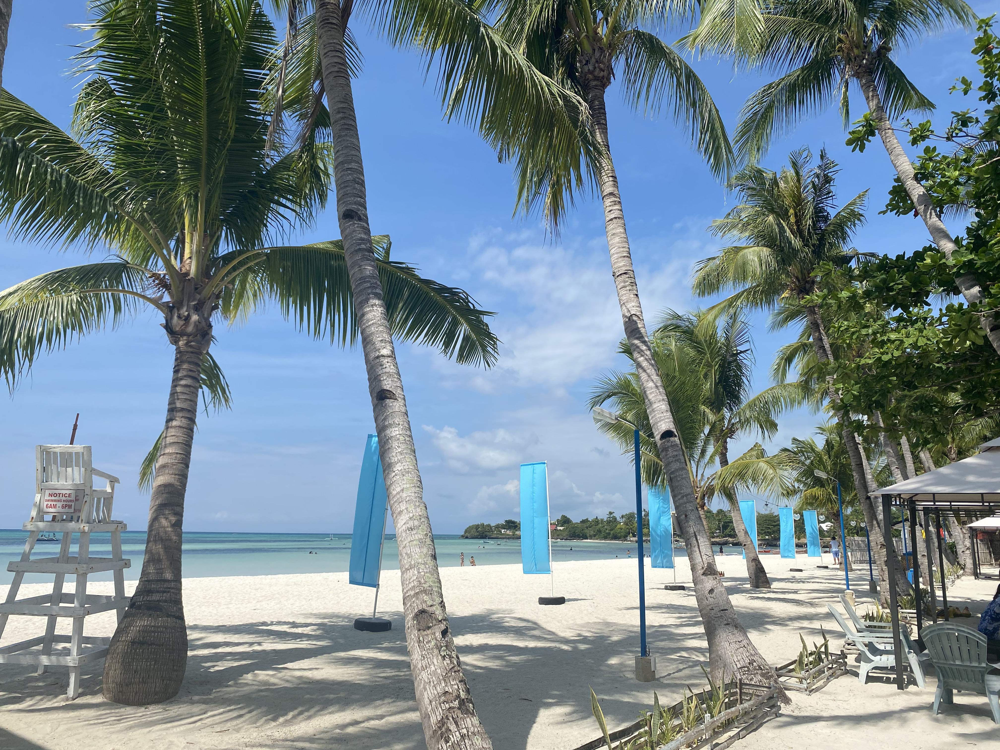
_Bantayan Island beach view_

My friends and I went to Bantayan Island on the second week of April 2021 since it was a long weekend (April 9 was The Day of Valor or *[Araw ng Kagitingan](https://en.wikipedia.org/wiki/Bataan_Day)*). Personally, it's my second time on the island, yet I cannot get enough of it. Beaches are my go-to destination when I want a relaxing and peaceful vacation.

We planned to stay for 3 days, 2 nights, April 9 - 11 (Friday to Sunday). However, my flight to Cebu on the 9th of April was moved from 8 am to 6 pm. Rebooking was not an option as other flights have a Manila layover -- which was too risky given the COVID situation. This derailed our plans of leaving for the island at 9:30 am. I've outlined some *tips* below on how to prevent last-minute changes like this and other safety tips.

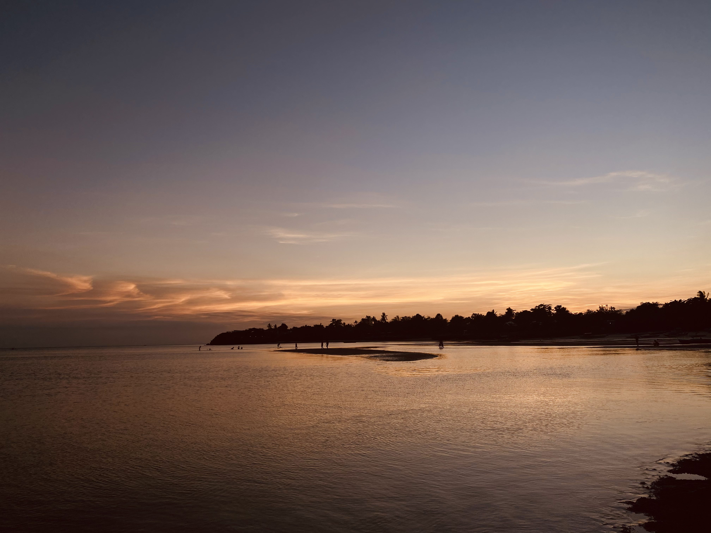
_Golden hour -- a breathtaking sunset, view from the resort_

> **In a gist, a trip to Bantayan Island for four people traveling through a private car for 2 days and 2 nights costs around 4,200 Php to 4,500 Php.**

In this article, you'll learn the following:

- How to get to Bantayan Island (via private car)
- Getting around Bantayan
- Where to stay
- Our stay in La Playa Beach Resort
- Where to eat
- How much it costs / table of expenses
- Leaving Bantayan Island
- COVID-19 rules
- Additional Tips

---

## How to get to Bantayan Island

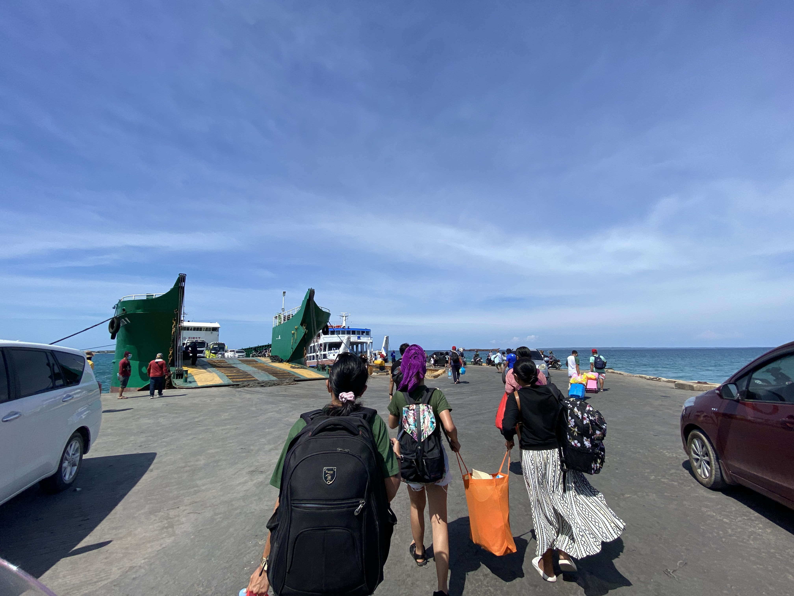
_Riding the island ferry from Bantayan Island_

There are two ways to travel to Bantayan Island: by [ferry shuttle](https://bantayanisland.com/listings/bantayan-island-ferry-schedules-fares/), or by [plane](https://sugbo.ph/2020/bantayan-island-airport/). The former is the more budget-friendly way to travel, although it may take you around **4-6 hours of travel time** from Cebu City to your resort.

Because of coronavirus and other safety concerns, the four of us decided to travel by **private car**. Initially, we had every intention of ferrying the car to the island (_cost is 1,270 Php one-way_) but, because of my flight changes, we decided against it.

That was a good move. On Sunday, there was heavy traffic as everyone was rushing to get home. Those who had brought their vehicles had to leave earlier or risk getting deferred to the next trip due to the ferrys' full capacity.

For an updated list of Bantayan Island ferry schedules and fares, click [here](https://bantayanisland.com/listings/bantayan-island-ferry-schedules-fares/).

### Night Travel by Private Car

We left our place in Cebu around 11:45 pm on April 9 and traveled to [Hagnaya Port](https://bantayanisland.com/listings/hagnaya-port-information/) where we were to ride the ferry bound for the island. Including fast food drive-thrus, and stopping at ATMs and convenience stores, we arrived at the port at around 2:45 am on April 10. **The travel time was 3 hours in total**.

We left the car at a fenced parking area near the port (across a 7/11 store), which cost us 150 Php per date (April 10 & 11). Then, **we boarded the ferry scheduled to depart at 3:00 am**. This was the **Island Shipping** **Ferry**, which was smaller and had less capacity than the **Super Shuttle Ferry**. Including us four, there were only around 15 passengers on board.

The ferry left around 3:30 am since it took a while to load all the trucks. This worked in our favor as we bought our ticket at 3:00 am (_cost is 180 Php / person_). Tired from all the traveling, inevitably, we slept the entire time with our face masks on.

### Arrival at Santa Fe Port, Bantayan Island

**We arrived at the island around 4:45 am**, which makes the travel time by ferry around **1 hour**. After alighting from the ferry, we had to walk to the receiving area where an *Ecological Fee* of 30 Php per person was collected.

**There are NO required travel requirements to visit the island as of April 2021**, just that you had to follow the rules and regulations they set in addition to the safety protocols.

You may get a pamphlet of the rules and tourist destinations around the island that you can book in the receiving area.

---

## Getting around Bantayan

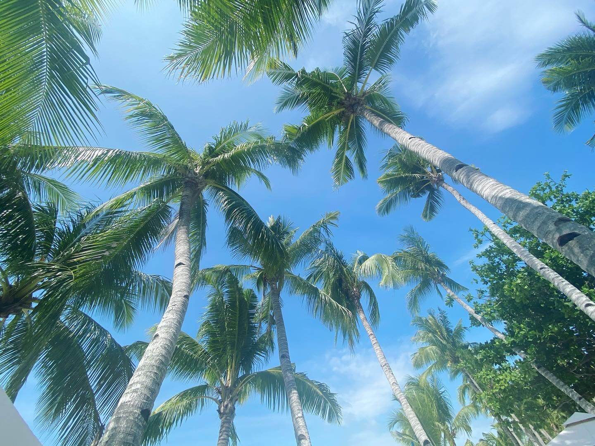
_Beautiful island feels that ensure a relaxing stay_

If you didn't bring a car like us, the best way to travel around Bantayan Island, especially when you're in a group, is via a **motorized tricycle** **or *trike***. Depending on the size, it can accommodate up to 6 people. The price is around 20 Php - 30 Php / person depending on the distance.

Of course, if you're a bit more adventurous, another way to get around is through a **motorcycle taxi called *habal-habal***, where passengers back-ride on a motorcycle. This is best for taking great travel videos.

With regards to traveling to and fro the resort you're staying, most beach resorts on the island offer a **free shuttle service** from the port and back at certain times. You'd have to confirm this with the resort.

---

## Where to stay in Bantayan Island

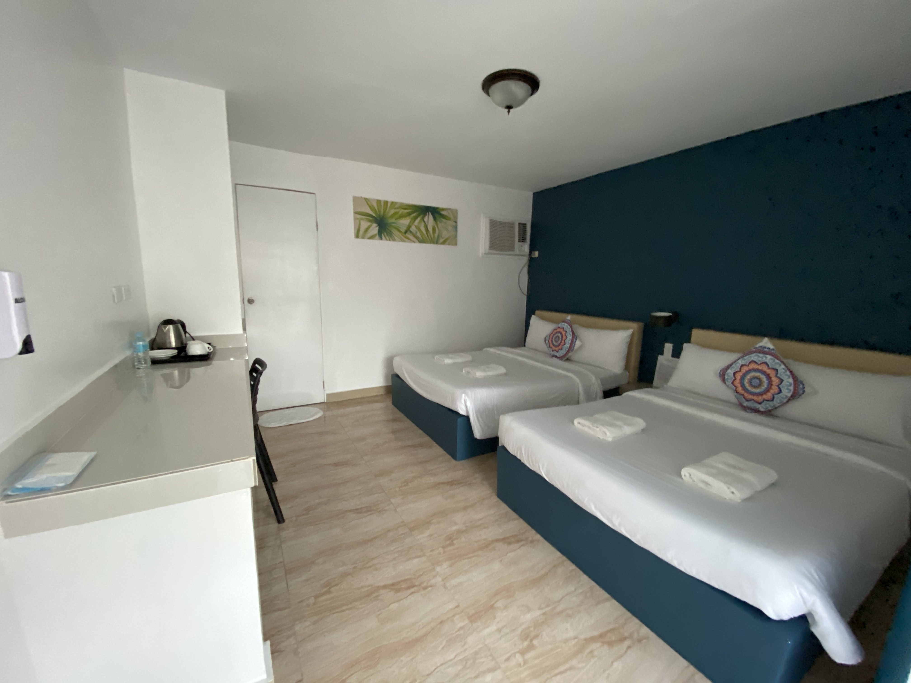
_Our room at La Playa - good for 4 people_

There are several popular resorts in Bantayan. The most well-known are [Kota Beach Resort](http://www.kotabeachresort.com/) (where the movie, [Camp Sawi](https://en.wikipedia.org/wiki/Camp_Sawi), was filmed) and [Anika Beach Resort](http://anikaislandresort.com/), which has a swimming pool of their own. These are usually fully booked early on, so last-minute booking is inadvisable.

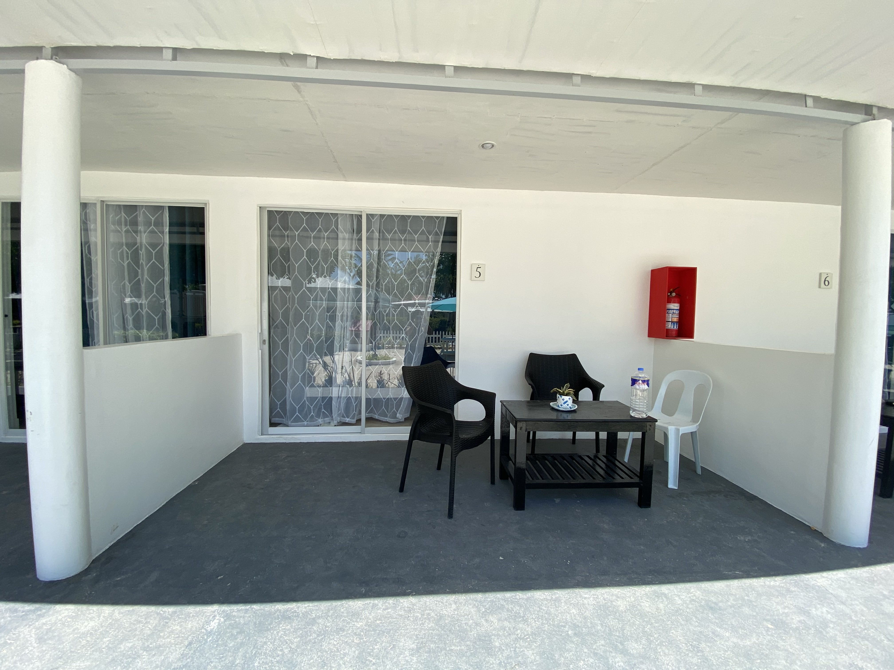
_Petite patio outside each room at the resort_

To look for places to stay on the island, visit [Booking.com](http://booking.com/), [Agoda](http://agoda.com/), and [Airbnb](http://airbnb.com/), among others. There are many beach-front resorts available. In our case, we booked in advance at [La Playa Estrella Beach Resort](https://www.laplayaestrella.com/). The room was compact and clean, with a minimalist design and vibe.

---

## La Playa Estrella Beach Resort

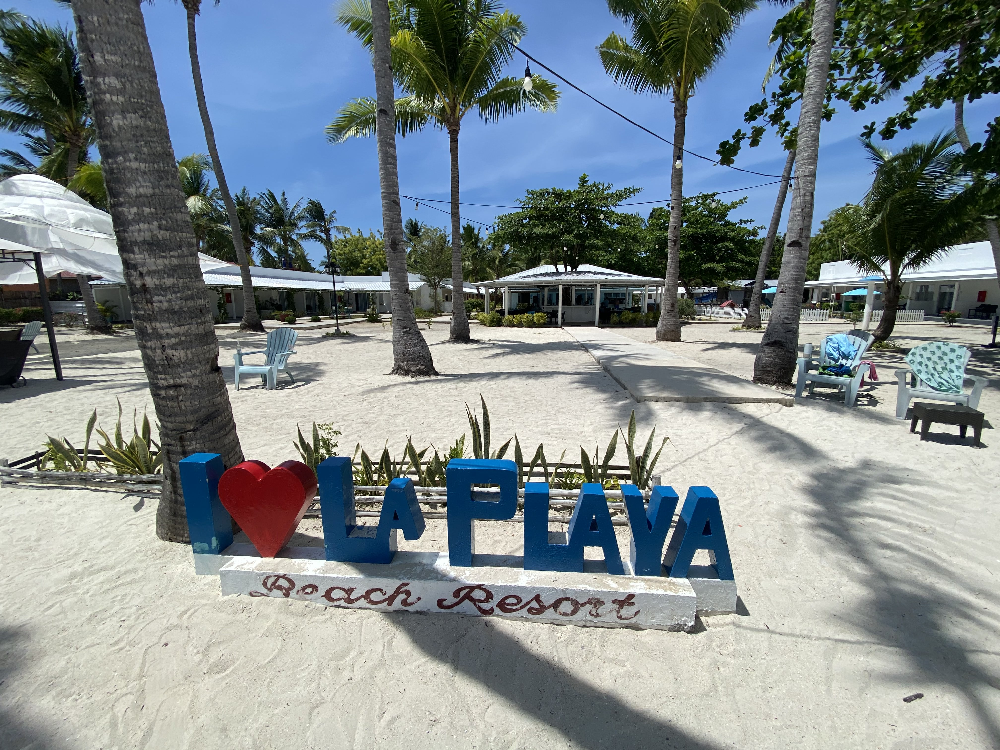
_We booked our stay at La Playa Estrella Beach Resort_

[La Playa Estrella Beach Resort](https://www.laplayaestrella.com/) is a peaceful resort that boasts a serene and spacious atmosphere with a beachfront. It includes a seating area in the garden and a playground for kids. The resort has beach beds and chairs so you can dine, drink, and read by the shore. They also have a bar and restaurant for your dining needs and a live singer at night.

The place is so chill and tranquil. I believe their capacity is smaller than the more popular resorts, which means it's *much less* crowded. Although there were a lot of tourists, the place wasn't congested. **It's ideal for travelers who are looking for a relaxing day at the beach.** It was perfect for us since we weren't looking for an adventure -- just a relaxing time.

They don't offer tour packages, though. Hence, if you wish to go island hopping, or visit the [Virgin Island in Bantayan](https://sugbo.ph/2018/virgin-island-bantayan-cebu/), for example, you'd have to book directly through the Travel and Tourism office at the port.

### **Arriving at La Playa**

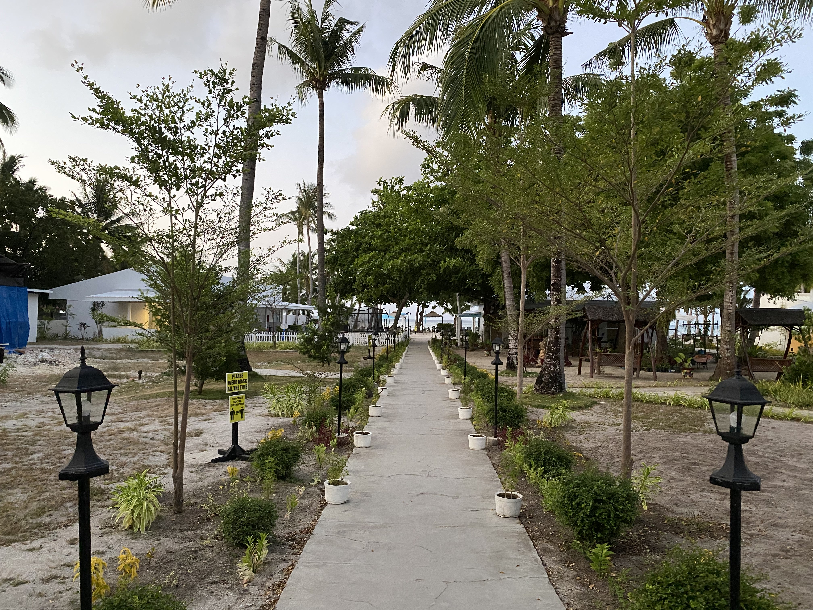
_View of the resort from the reception / entrance_

They offer a free shuttle service to and fro the port, though only at certain times. Since we arrived at dawn, we had to ride a *trike* that cost 30 Php / person as the resort was on the other side of the island. We successfully checked in at the Resort at around 6 am.

Our room, *room 5*, was near the beachfront. It was a clean and quaint airconditioned room with two queen beds, a private bathroom, bath towels (white) and beach towels (blue), complimentary coffee and water, and a patio with outdoor chairs.

They charge a corkage fee if you bring in food from the outside to the allow. Fortunately, they allow junk foods and other snacks.

For potable water, 6-liter water is available for purchase at the resort as well as service water at the restaurant.

### **Chillin' by the beach**

_Chillin' by the beach at the resort_

We spent most of our time at the resort, alternating between eating and sleeping for most of day 1 as we were exhausted from traveling. Around 4:30 pm, we swam at the beach, though, unfortunately, it was low tide. The good thing about the beach, apart from its beautiful white sand and artistic, natural colors, is that it's not too salty.

<Row>
<Col>

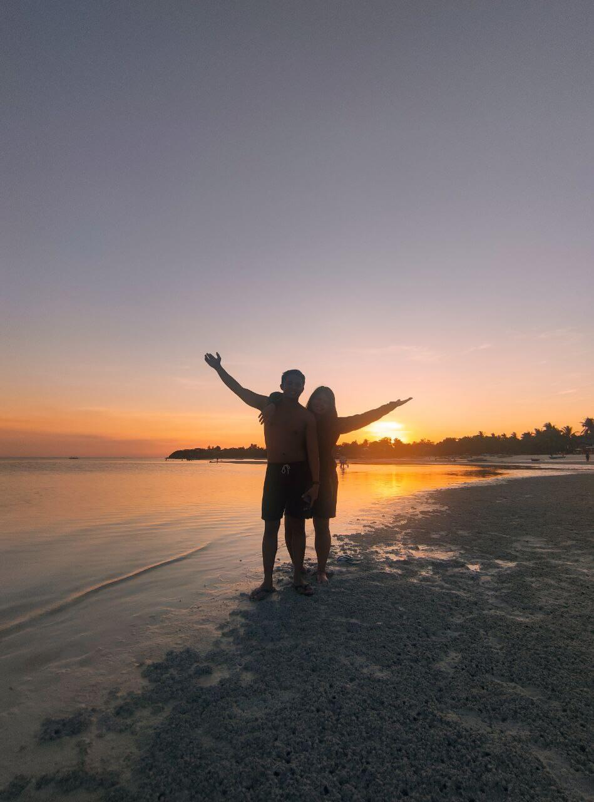
_Sunset view (iPhone shot)_

</Col>

<Col>

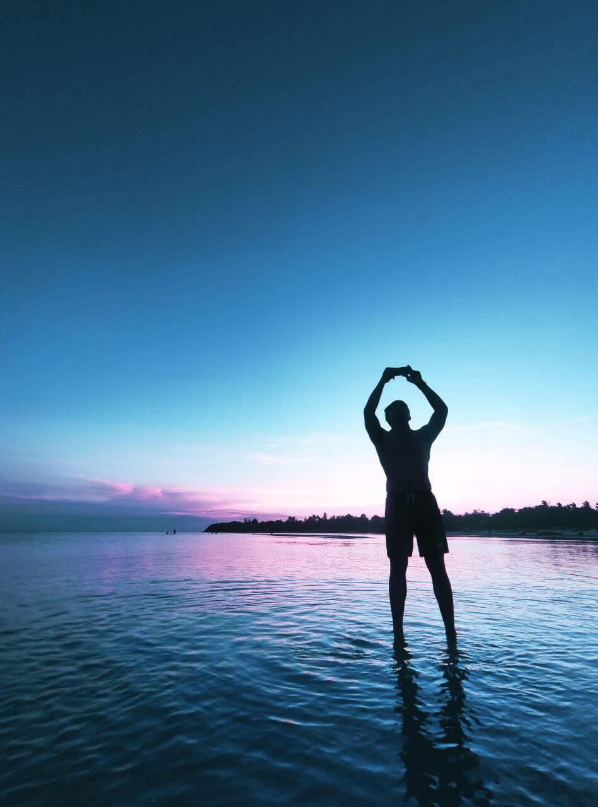
_Sunset view (Android phone)_

</Col>
</Row>

**The silver lining of it all is the view during the golden hour.** The breathtaking sunset showed off streaks of pink and purple in the golden sky. It was absolutely picturesque and definitely "instagrammable".

We had most of our meals at the restaurant in their resort, except for dinner, which we had at MJ Square (_see 'where to eat' below_). There's a line of *trike* outside the resort so getting around wasn't difficult.

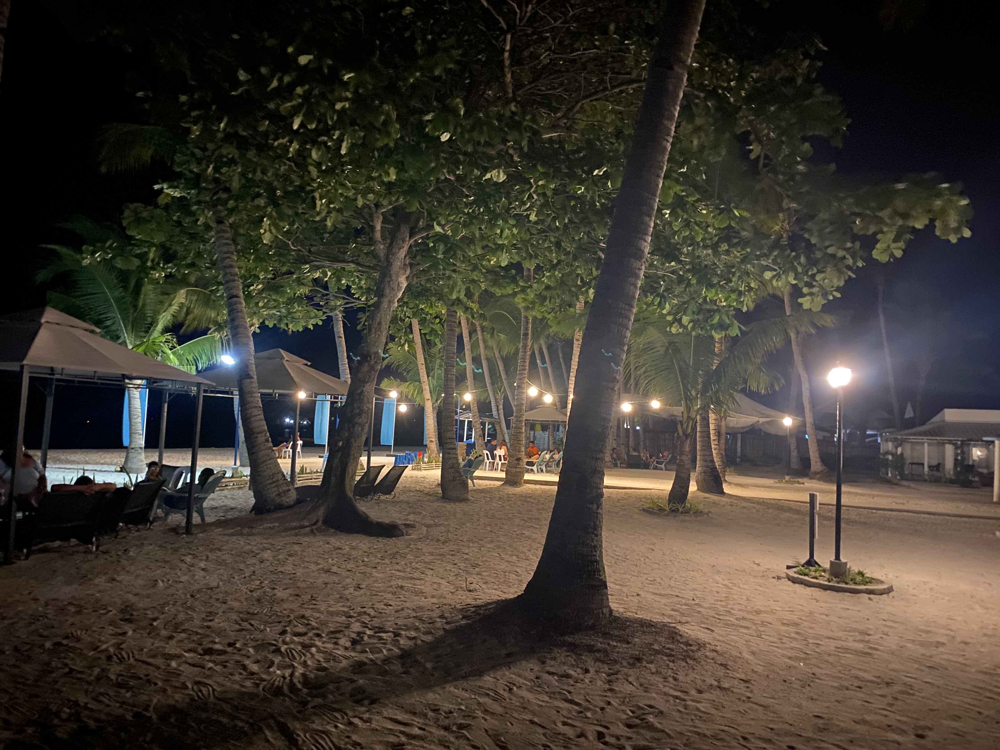
_View of the resort at night -- tourists chillin' by the beach_

At night, we hung out by the beach, drinking, chilling, and playing card games. There was a live singer at the restaurant, which can be heard near the shore. The night breeze was cool and lovely, and the ambience was delightfully relaxing. It's exactly the vacation we needed.

The next day, the tides were in our favor. After a sumptuous breakfast and ample waiting time, we headed straight to the beach and enjoyed a 2-hour swim in deep water. Despite the high tide, we serendipitously rediscovered the starfish we found the day before when the tide was low. That was a happy coincidence.

### **Leaving La Playa**

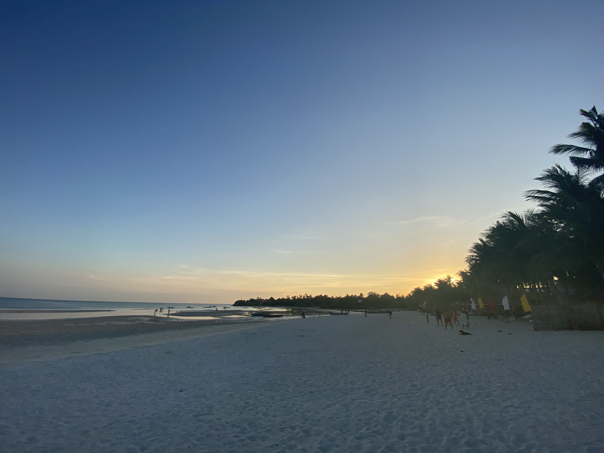
_View of the beach at dusk_

We left the beach resort at check-out time, noon, and rode their free shuttle to the port. It was such a pleasant stay, and the place is certainly beautiful.

If you're looking for a quiet day at the beach, then this beach resort is highly recommended.

---

## Where to eat

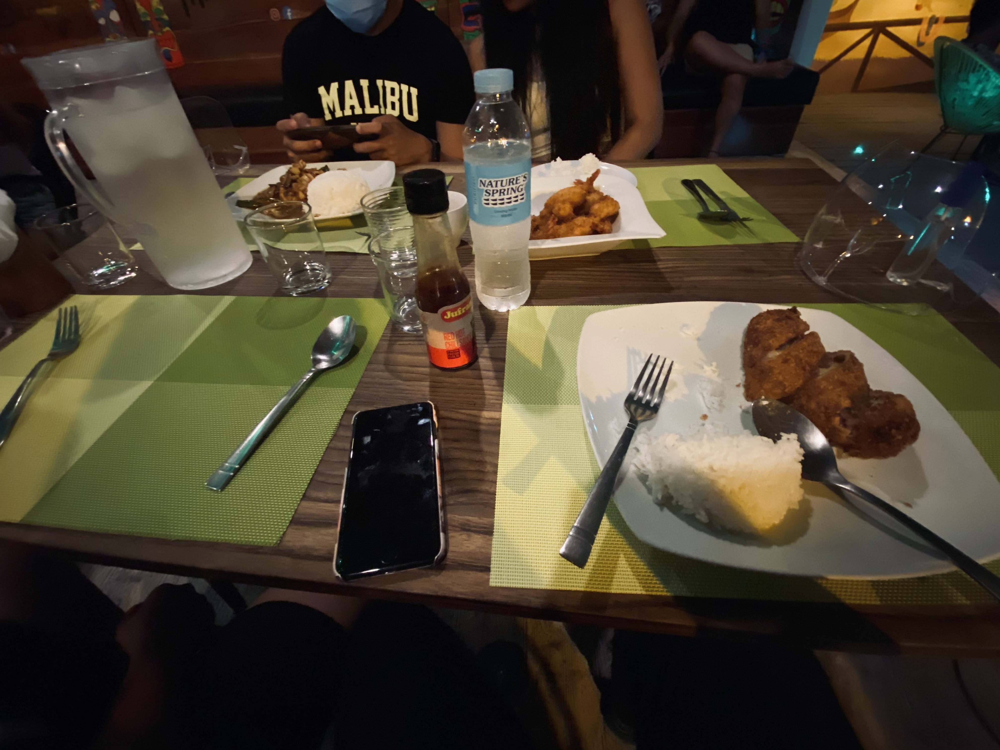
_Dinner at MJ Square_

[**MJ Square** Beach Placid Multi-Ventures, Inc.](https://web.facebook.com/MJSquareSantaFe/) (or just MJ Square) is the most popular place to eat at Bantayan Island. From grilled foods to seafood, breakfast to dinner, beers to desserts, the numerous restaurants here will surely satisfy any *foodie* on vacation.

During the long weekend, the place is jampacked with tourists, especially at night. If there are no seats available, don't fret. There are also several restaurants around the area within walking distance.

---

## Trip Expenses

Our trip was initially 3D 2N, but due to unavoidable flight changes during the pandemic, it was cut short to 2D 2N as the four of us traveled to Bantayan Island at dawn.

> **Our total expenses is 16,680 Php for 4 people, or 4,171 Php per person.**

Here's a detailed table of all our expenses throughout the trip.
<table>
    <thead>
      <tr>
          <th>Name</th>
          <th>Cost</th>
          <th>Cost / Person</th>
      </tr>
    </thead>
    <tbody>
      
      <tr>
        <td>Resort Accommodation</td>
        <td>7275</td>
        <td>1818.75</td>
      </tr>
      <tr>
        <td>Junk Food / Other supplies</td>
        <td>500</td>
        <td>125</td>
      </tr>
      <tr>
        <td>Full tank of gas</td>
        <td>700</td>
        <td>175</td>
      </tr>
      <tr>
        <td>Car parking (2 days)</td>
        <td>300</td>
        <td>75</td>
      </tr>
      <tr>
        <td>Ferry Fare (Hagnaya Port > Santa Fe)</td>
        <td>720</td>
        <td>180</td>
      </tr>
      <tr>
        <td>Ecological Fee</td>
        <td>120</td>
        <td>30</td>
      </tr>
      <tr>
        <td>Trike Fare to resort</td>
        <td>120</td>
        <td>30</td>
      </tr>
      <tr>
        <td>Breakfast (Day 1)</td>
        <td>1030</td>
        <td>257.5</td>
      </tr>
      <tr>
        <td>Drinking water (6 L)</td>
        <td>65</td>
        <td>17</td>
      </tr>
      <tr>
        <td>Lunch (Day 1)</td>
        <td>1470</td>
        <td>367.5</td>
      </tr>
      <tr>
        <td>Dessert (Day 1)</td>
        <td>195</td>
        <td>49</td>
      </tr>
      <tr>
        <td>Trike Fare to and from MJ Square</td>
        <td>160</td>
        <td>40</td>
      </tr>
      <tr>
        <td>Dinner (Day 1)</td>
        <td>1050</td>
        <td>262.5</td>
      </tr>
      <tr>
        <td>Drinks/Beers (Day 1)</td>
        <td>510</td>
        <td>127.5</td>
      </tr>
      <tr>
        <td>Breakfast (Day 2)</td>
        <td>880</td>
        <td>220</td>
      </tr>
      <tr>
        <td>Lunch (Day 2)</td>
        <td>865</td>
        <td>216.25</td>
      </tr>
      <tr>
        <td>Ferry Fare (Santa Fe > Hagnaya)</td>
        <td>720</td>
        <td>180</td>
      </tr>
    </tbody>
</table>

A summary of our expenses by category shows that the most expensive part of arguably most trips is the **accommodation**.

- **44%** — Accommodation
- **17%** — Transportation
- **39%** — Food and Drink

It's always more economical to travel in a group. But, it's both economical _and_ convenient to travel with a couple. 

---

## Leaving Bantayan Island

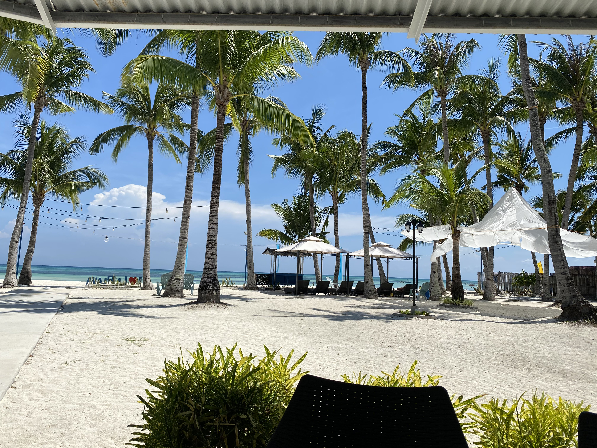
_View from the restaurant at La Playa Resort_

We were scheduled to leave on Sunday, April 11. With the long weekend, there was a sea of people leaving that Sunday afternoon. Needless to say, the 1m - 2m social distancing was not observed.

Most of the people from the resort left before 9:00 am to catch the morning trip. This is advisable especially if you brought a car to the island. The queue that afternoon was so incredibly long and the traffic was terrible.

At the receiving area, you'd have to stand in queue for about 10-15 minutes before you can finally buy a ticket (_costs 180 Php for adults_). If you're in a group, only one of you can stand in line while the rest will need to proceed to the terminal or pre-departure area where you wait for the ferry to arrive. The terminal fee will cost you 5 Php per person. It's not air conditioned, but there are large fans in certain areas so it wasn't too warm.

The ferry isn't reserved seating; it's first-come-first-served. You'd have to board early to get good seats. We rode the **Super Shuttle Ferry** which had more capacity — there were seats inside, outside, and towards the back of the ferry. Fortunately, despite boarding at the last minute, we managed to find four seats next to each other.

The trip was 1 hour long. Upon arrival at the Hagnaya Port, we retrieved our car and were well on our way after around 30 minutes or so. The travel is exhausting and there's moderate to heavy traffic going back to the city, but all in all, it was such an amazing experience — this having been the first vacation I've had after the pandemic broke.

---

## COVID-19 rules

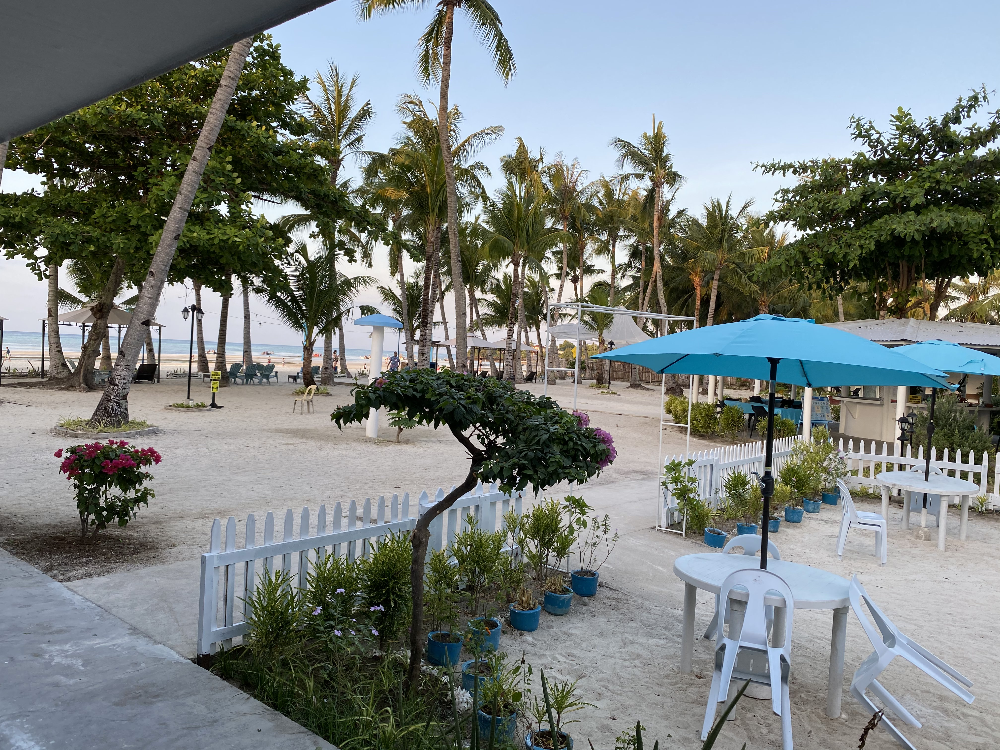
_View of the playground at the resort. COVID-19 rules in signs everywhere._

With the rest of the Philippines under MGCQ as of April 2021, the [guidelines set by the IATF](https://www.officialgazette.gov.ph/downloads/2021/01jan/20210121-IATF-OMNIBUS-GUIDELINES-RRD.pdf) should be observed at all times.

- **Face masks** are required to be worn at all times, even in the resort. Although, this isn't strictly observed since the resort has a restaurant, and most people are going in and out of the beach.
- **Social distancing** of at least 2 meters should be observed. People, I should say were pretty cautious on the island.
  - Although, at **MJ Square** and during the **ferry ride home**, the 2m distancing was *not* observed at all. Unfortunately, this is challenging to implement in crowded places. If you do observe a 1m distance during the queue to buy a ferry ticket home, for example, people will **cut the line** or insert themselves in front of you.
  - To counter this, wear long sleeves and pants in case you inevitably brush up against someone or something during your visit.
  - Fortunately, at the resort, the sunbeds have ample distance between them and so are the tables at the restaurant. Also, the beach is wide enough so the distance is at least 3 meters among the tourists swimming in the ocean.
- Wear **face shields** when going out of the resort or visiting restaurants, especially in crowded places.
  - Everyone wore masks when we were at MJ Square -- **you will get caught and be fined if you don't have a mask on**, but not everyone was wearing a face shield. Despite the heat, please do wear one.
- Have **rubbing alcohol on your person at all times.** Most restaurants that we visited had free alcohol on their tables and washing areas available.
  - The paranoid traveler that I am, I have a small alcohol spray in my pocket, a large one, and wet wipes in my bag at all times. I could finish a 40ml alcohol in a few hours. *Better safe than sorry*, I say.

Since restrictions for non-essential (or vacation) traveling was eased, tourists are *not* required to fill up any form or take a swab test when visiting Bantayan Island.

---

## Additional Tips

#### **Don't schedule your flight on the day of your trip to Bantayan Island**

Because of the pandemic and with the country in long-term community quarantine, flights are often rescheduled or canceled without prior notice. My flight was moved from morning to night, which derailed our plans to travel to Bantayan Island in the morning, traveling at dawn instead.

Rescheduling the trip wasn't an option since the flight announcement was well past the allowable time to get a full refund or change the booking for free at the beach resort.

#### **Drink medicine that prevents motion sickness**

To prepare yourself for the long (and bumpy) drive and ferry ride, make sure to drink [Meclizine Hydrochloride](https://www.rxlist.com/meclizine-hydrochloride-drug.htm#description) (like *Bonamine*) an hour before travel to prevent motion sickness, nausea, and vomiting. It will help keep the ride more comfortable.

#### **It's HOT in the PH. Always apply sunscreen to all exposed areas and drink water.**

With global warming and summertime in a tropical country, the temperature on the island ranges from 28 degrees to 32 degrees Celsius. To prevent sunburn and heatstroke, make sure to apply sunscreen every day and bring water wherever you go.

#### **Use Splitwise app to help settle expenses when traveling in a group**

Splitting expenses and deciding who paid what and when is one of the challenges when traveling with friends. We use the mobile app, [Splitwise](http://splitwise.com/) to help divide our expenses easily.

---

## Final Thoughts

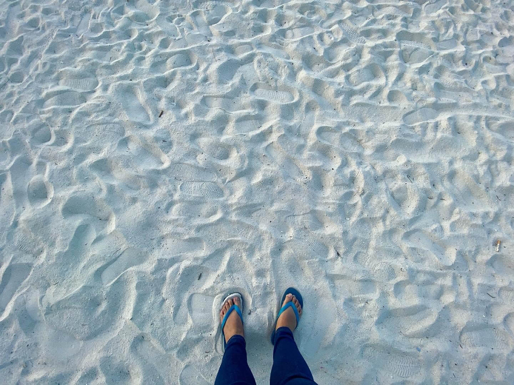
_Footprints in the sand_

After over a year of lockdown because of the coronavirus pandemic, many people are itching to have a much-needed vacation now that travel restrictions have eased in certain parts of the country.

As long as we exercise self-discipline when observing health and safety protocols, and remain vigilant, we can stay safe and still have fun as we navigate through the new normal.

May you stay safe and have fun in your travels this year! 😊
