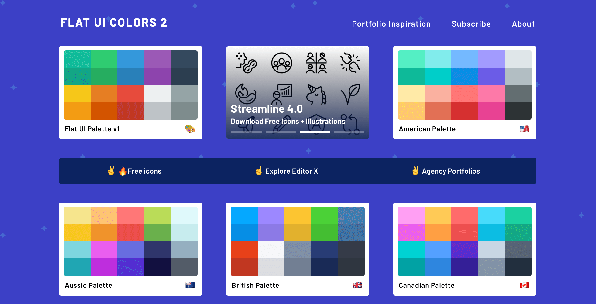

I loved how my social media profile looks! My Twitter header is engaging and has a value proposition for my followers (and potential followers). Both my header and photo have a matching background color too, making them more appealing and easier on the eyes.

_LinkedIn Profile_

_Twitter profile_

## Why is this important?

Profile pictures on social media represent an image of you that you would want others to see in yourself -- are you serious (formal photo), laid-back (beach or "chill" photos), adventurous (photo of you doing daring activities), quirky ("wacky" photo), artistic (creative shot), or tech-savvy What if the platform calls for formal shots?

Photos with edited background photos to the rescue! Changing the background of your photo gives you more options — you can literally pick any photo you want for any setting. This flexibility helps you with personal branding.

Headers or banners, on the other hand, supplement your profile by giving your visitors the highlights and setting their expectations. This helps you control the narrative and even promote your businesses and side hustles.

Together, they can contribute to the quantity and quality of your followers, ensuring those who choose to do it sees value in your profile and the content you share.

---

## The Tools

Here are the online tools you can use to make beautiful profile pictures and headers:

### [Headers.me](https://www.headers.me)

Create simple yet valuable headers at [Headers.me](https://www.headers.me). "Headers that get you more followers. Made in seconds."

Tool: **Free and paid versions**

Nowadays, with everyone's screen time drastically increasing as we're all staying safe at home, building a large follower base is important. More often than not, the profile's header helps profile visitors determine whether or not they would want to follow you.

I use this site to add text and emojis in my header in both my [Twitter](https://twitter.com/minaopada) and LinkedIn accounts. The *free* version is perfect for an elegant and straightforward header that shows followers (and potential followers) the value they can get from following you.

### [Flat UI Colors 2](https://flatuicolors.com/)

Hundreds of beautiful handpicked color pallets to choose from at [flatuicolors.com](http://flatuicolors.com/).

Tool: **Free forever**

When designing anything -- from website and mobile apps to creative content-- this website is my absolute go-to. Personally, I'm not a designer so I don't have the "eye", the creativity of knowing which colors work well with one another. This website makes up for it.

With this site, I select the color I'm most drawn to, and apply that to the background of both my social media header and profile picture.

### [Remove.bg](http://remove.bg)

Remove the background from your photos at [Remove.bg](http://remove.bg).

Tool: **Free + Subscription plan**

When I found this tool on [ProductHunt](http://producthunt.com/) over a year ago, I stopped asking my brother to photoshop my photos. Because of it, I can now use casual, more flattering shots as a display picture on platforms that call for formal photos.

In my current Twitter photo, for example, I was actually under a shade, sitting on a monoblock chair, in a popular tourist spot in the Philippines. Thanks to [remove.bg](http://remove.bg/), I use that photo in the office and on my social media accounts.

---

## Final Thoughts

These tools will help you get started in crafting a clearer and more creative image of yourself on social media platforms in this world of screens. Know more tools? Let's talk about them on [Twitter](https://twitter.com/minaopada).
