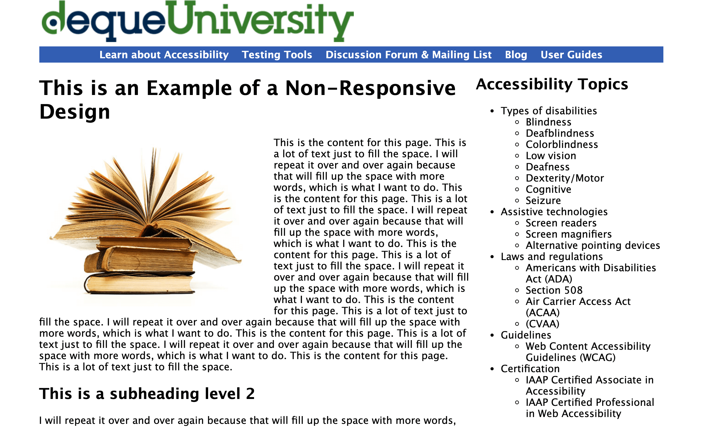
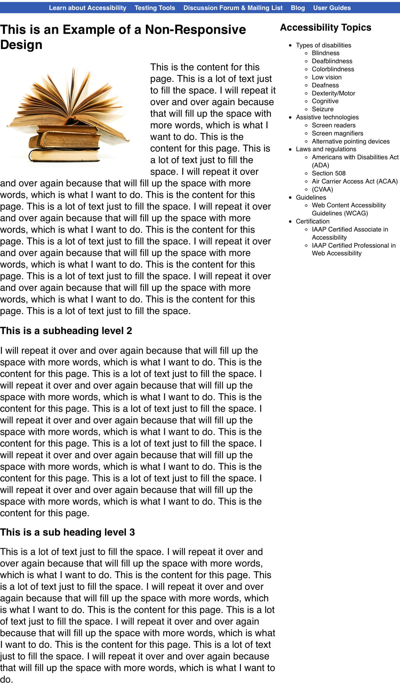
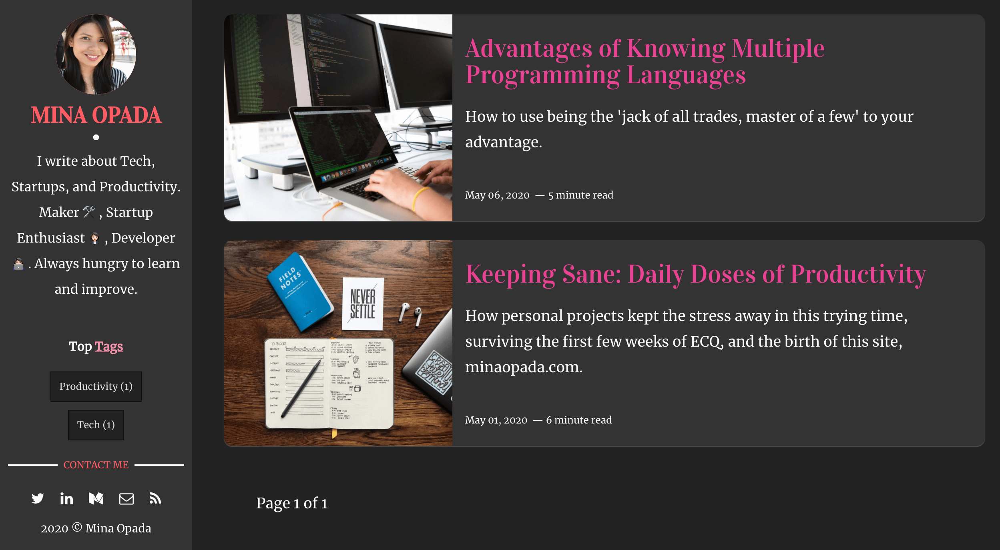
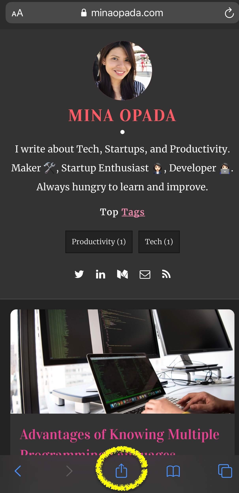
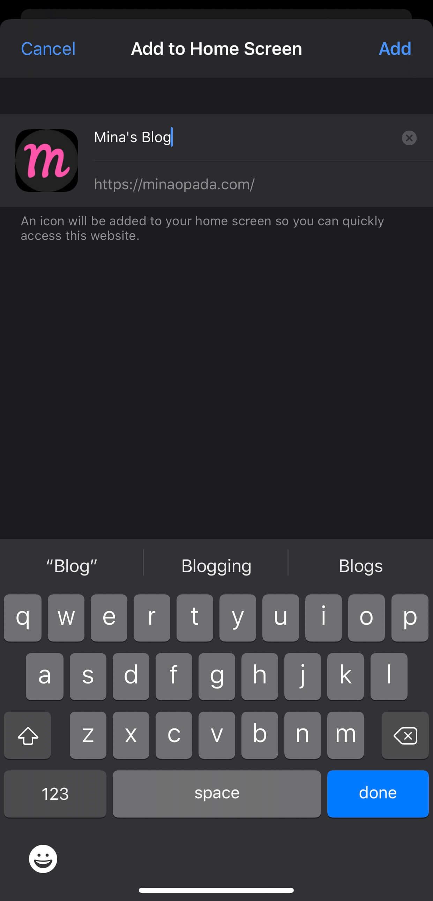
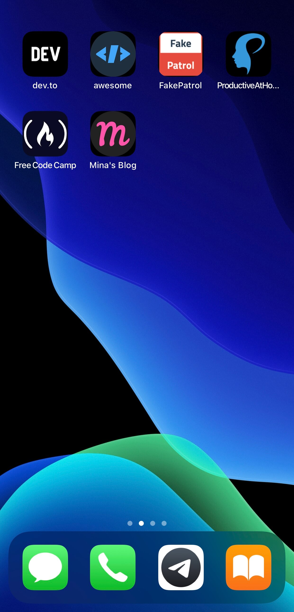
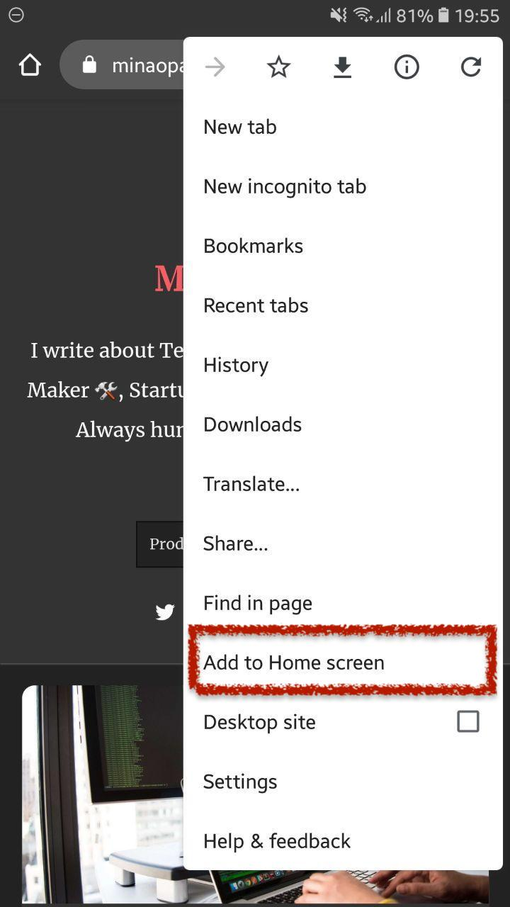
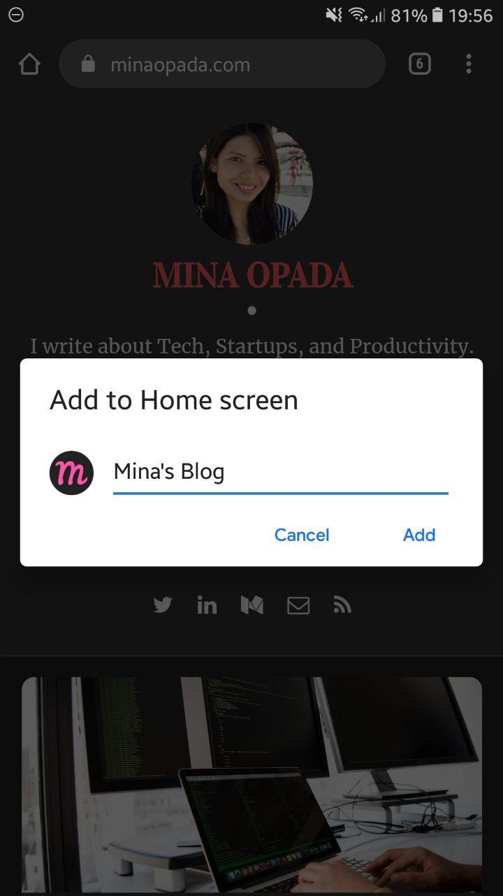
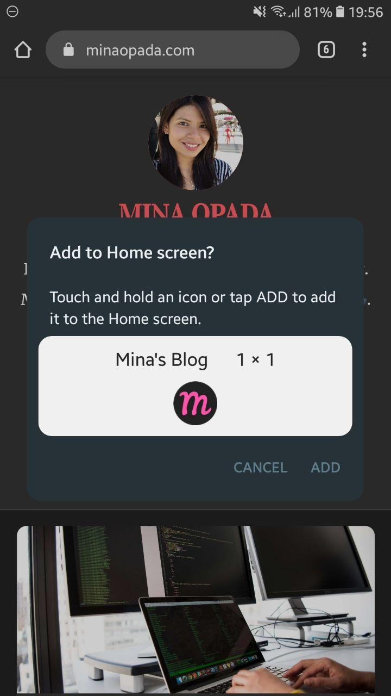
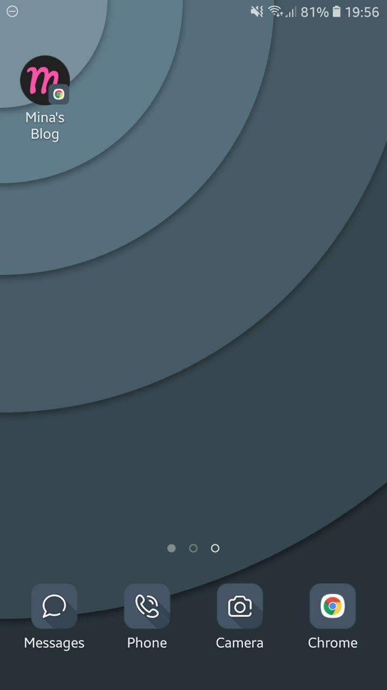

Nowadays, **most people browse online through their smartphones.**. Mobile devices are increasingly overtaking desktops in terms of market share ([StatCounter](https://gs.statcounter.com/platform-market-share/desktop-mobile-tablet)). Now, more people spend their time online on mobile devices over desktops ([TechJury](https://techjury.net/stats-about/mobile-vs-desktop-usage/#gref)).

However, **only a small chunk of web apps have corresponding mobile apps**.

---

## Why aren't there more mobile apps?

Mobile applications are far more expensive to develop than web apps. And I don’t just mean the money. The go-live process takes longer, too. Then, Apple and Google will have to review your app before it gets published on the App Store or Play Store.

On the other hand, website creation is straightforward: create the site, buy the domain, pay for hosting, and voila!

---

## Hope for the smartphones 📱: Responsive Web Apps

Websites make up for this by making the site **_mobile-friendly_**. In technical terms, this is known as **responsive web design**.

In a gist, responsive web apps are websites that can be beautifully rendered in a variety of devices. It does this by _adjusting_ to the device screen size.

### Non-responsive websites

Non-responsive websites, on the other hand, do _not_ adjust to the size of the device. This is an example of a [non-responsive website](https://dequeuniversity.com/library/responsive/1-non-responsive).

Desktop browser view:

Mobile view:

<Row>
<Col>

</Col>
<Col></Col>
</Row>

What you see on the desktop is also what you get on mobile -- and it's not pretty. The font is too small and you'll have to zoom in. It doesn't make for a great user experience.

### Responsive Websites

On the other hand, [this website](https://minaopada.com), as well as [the other sites I've created](https://minaopada.com/keeping-sane-daily-doses-of-productivity/), is a responsive one.

Desktop browser view:

Mobile view:

<Row>
<Col>

</Col>
<Col></Col>
</Row>

In the mobile view, the sidebar adjusted to take the width of the screen while maintaining its styles and content. This makes for a more readable site that allows a seamless transition to any device.

Now that we are familiar with responsive websites, let’s get right to it.

---

## How to access websites like an app on iOS 🍎

### Step 1: Open the website on Safari

Launch the site of your choice on the Safari browser. For best results, ensure that the website is **responsive**.

For illustration purposes, let's use [**minaopada.com**.](http://minaopada.com)

### Step 2: Click on the _share_ icon

The share icon is located at the bottom of the screen. It opens up the **share sheet** that gives you several choices on what you can do with the website.

<Row>
<Col>

</Col>
<Col></Col>
</Row>

### Step 3: Select _Add to Home Screen_ on the share sheet

The **Add to Home Screen** option opens another screen that allows you to customize the name of the bookmark.

<Row>
<Col>

</Col>
<Col></Col>
</Row>

### Step 4: Choose the name of the _site_

The name you choose will be treated as the app name.

<Row>
<Col>

</Col>
<Col></Col>
</Row>

### Step 5: Voila! Your bookmark is now on your home screen 💁🏻‍♀️

This technique can be used for your favorite websites, too. I have a whole page on my home screen dedicated to my **bookmarks**.

<Row>
<Col>

</Col>
<Col></Col>
</Row>

---

## How to access websites like an app on Android 🤖

### Step 1: Open the website on Google Chrome

Launch the site of your choice on the Chrome browser. For best results, ensure that the website is **responsive**.

For illustration purposes, let’s use [**minaopada.com**.](http://minaopada.com/)

### Step 2: Click on the _ellipsis_ icon on the upper right

The ellipsis icon generally means "more". It reveals several choices on what you can do with the website.

<Row>
<Col>

</Col>
<Col></Col>
</Row>

### Step 3: Select _Add to Home Screen_ on the share sheet

The **Add to Home Screen** option opens another screen that allows you to customize the name of the bookmark.

<Row>
<Col>

</Col>
<Col></Col>
</Row>

### Step 4: Choose the name of the _site_

The name you choose will be treated as the app name.

<Row>
<Col>

</Col>
<Col></Col>
</Row>

### Step 5: Either click and drag the icon or click the _add_ button

Android has an extra step where it allows you the flexibility of dragging the icon to position it on the home screen. Clicking **add** would place the bookmark to the next available slot.

<Row>
<Col>

</Col>
<Col></Col>
</Row>

### Step 6: Voila! Your bookmark is now on your home screen 💁🏻‍♀️

To reiterate what I said for iOS, this technique can be used for your favorite websites, too. I have a whole page on my home screen dedicated to my **bookmarks**.

<Row>
<Col>

</Col>
<Col></Col>
</Row>

---

## Summary

Responsive websites are sites that can be rendered in devices of different screen sizes. We can add **_bookmarks_** to our home screen so we can access our favorite websites just like we would a mobile app. Some of my favorite websites that don't have apps are [FreeCodeCamp](https://www.freecodecamp.org/) and [DEV](https://dev.to/).

With this technique, you can dedicate an entire page on your Home Screen for these sites and **🚀 launch them without having to use a browser**. Now that can shave valuable seconds of our time. 😉
