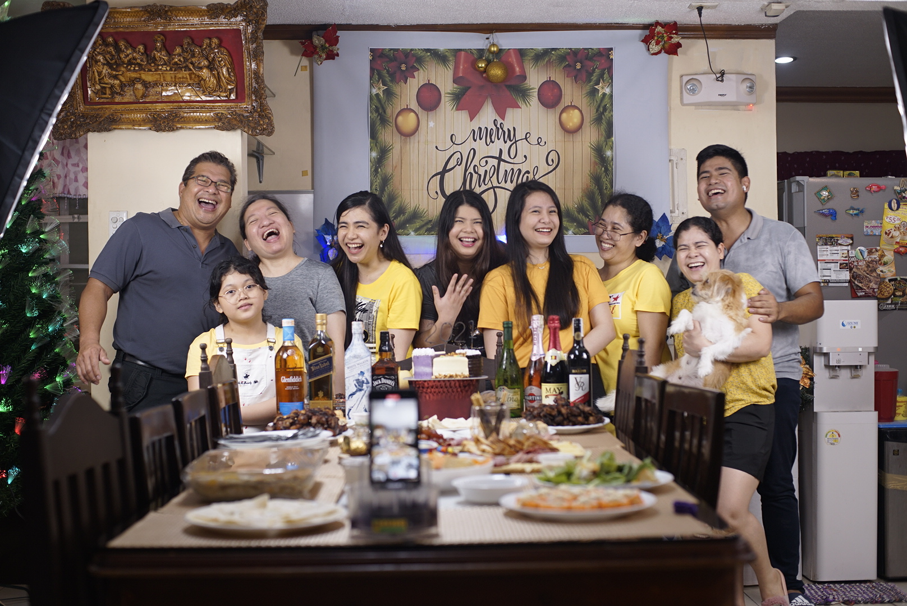
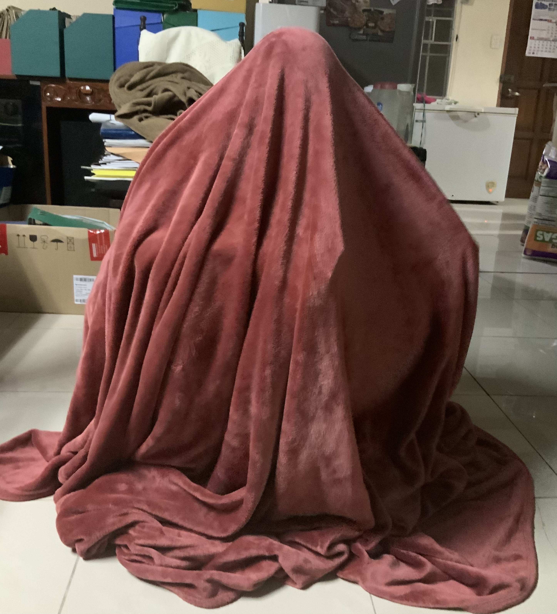
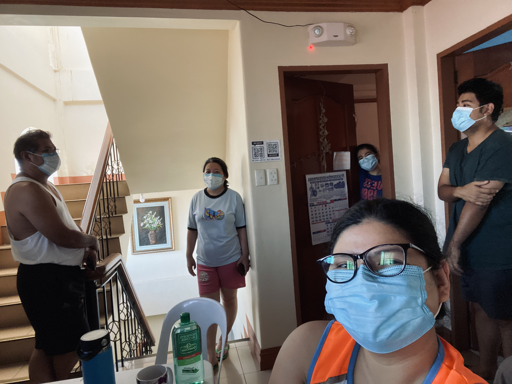
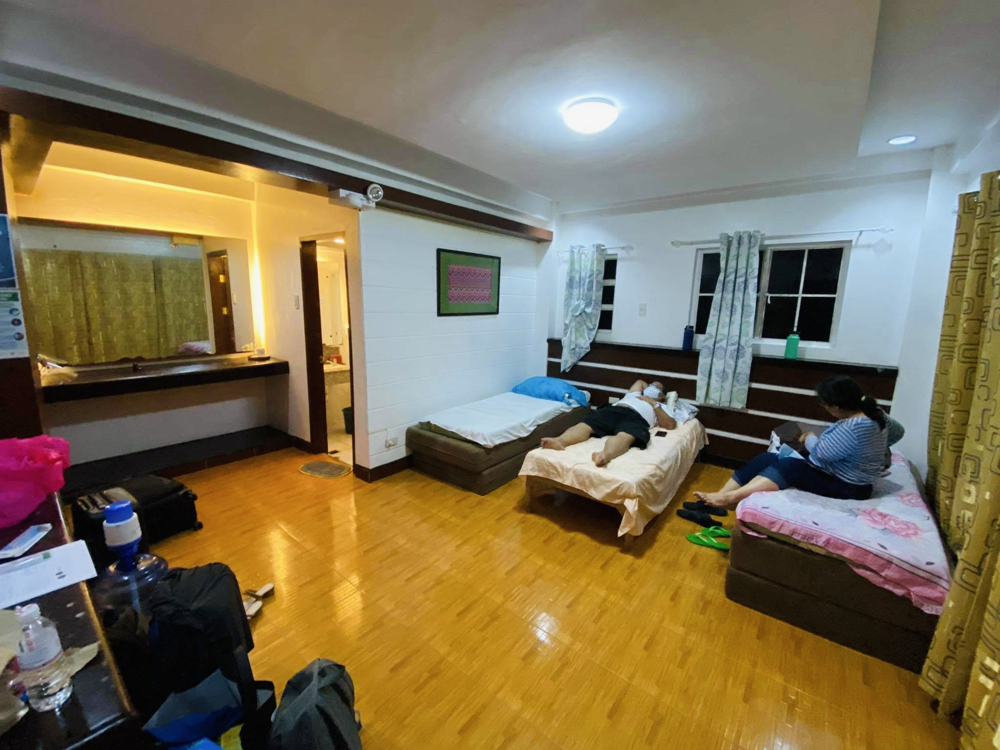
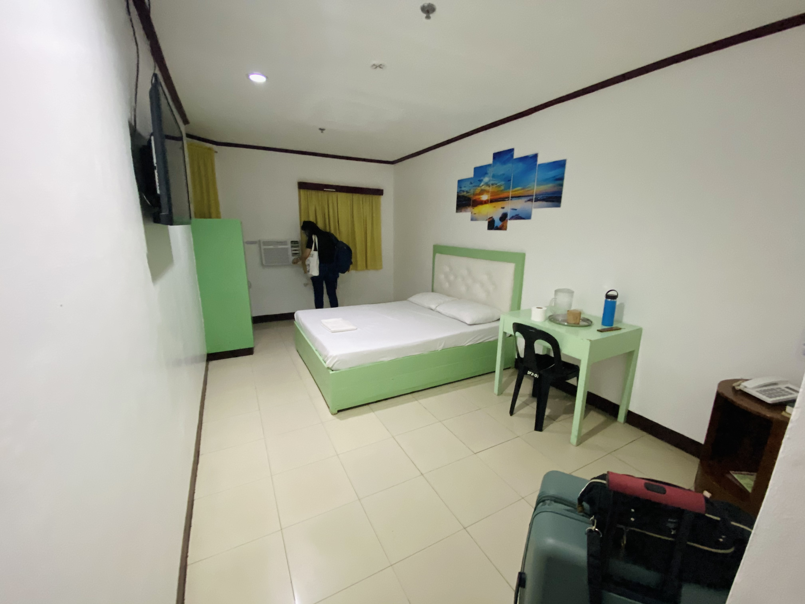
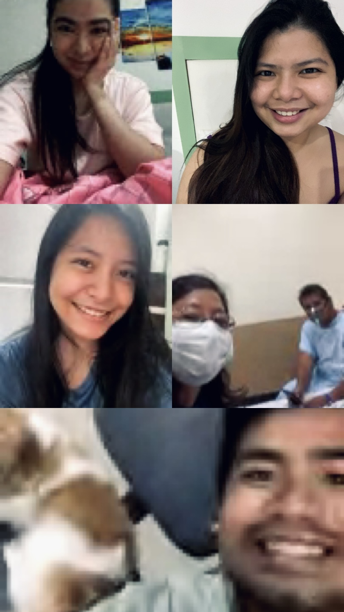
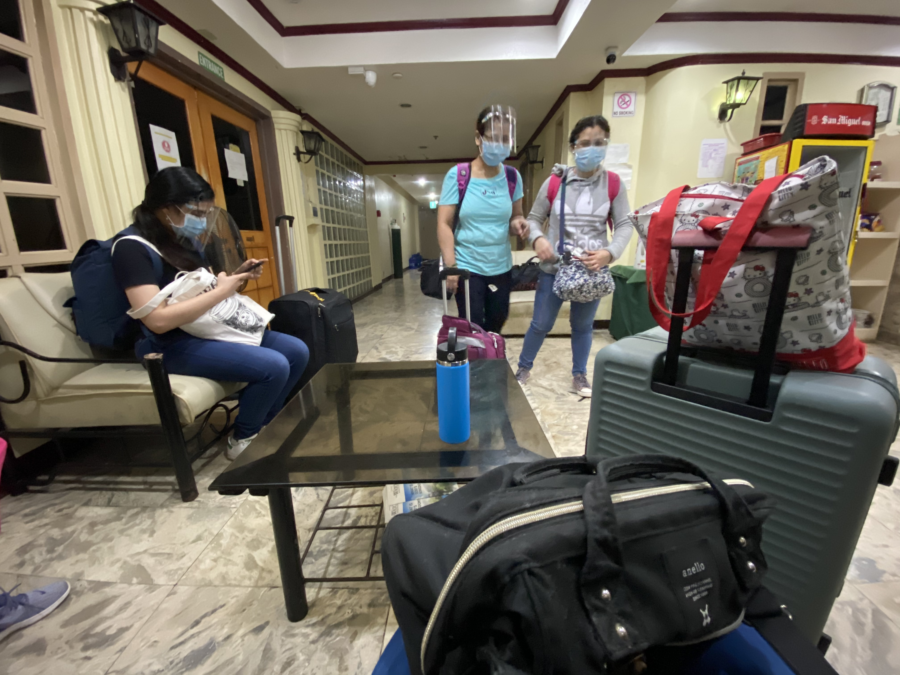
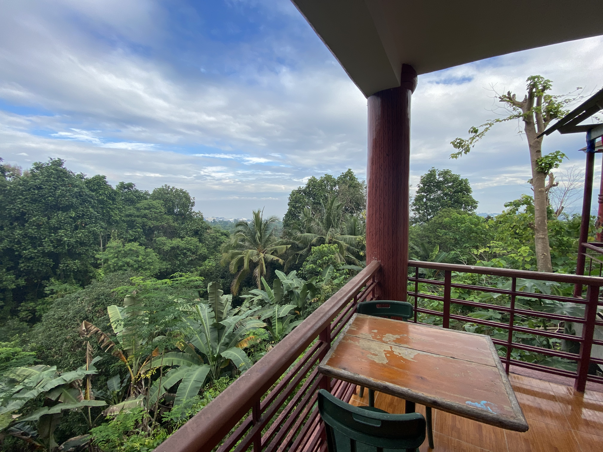
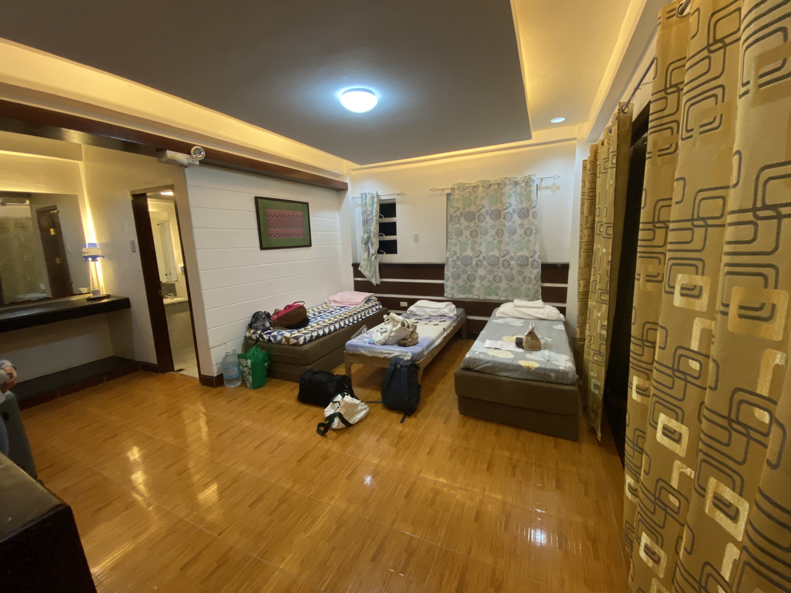

What’s it like to have COVID, you ask? To be part of the statistic? This is my COVID experience as someone who’s family is affected by COVID, how the local government has been handling it, and how it affected us as a family.

Last January 13, 2021, a Wednesday, my family and I received the most devastating news you can ever hear during the pandemic that shook and disrupted the whole world since 2020 — some of us are positive with COVID-19 🦠. At the time of writing, my father, my mother, my youngest sibling tested positive while my brother tested negative. The rest of us are still in the government’s isolation areas, waiting to be swabbed.

In this post, I’m doing something I’ve never done before in any channel — share something personal in a public avenue. I had a fairly lucrative blog in the past but the content was mostly around travel posts, movies/series ranking and reviews, and productivity posts. However, I am told that writing about personal tragedies can be therapeutic as evidenced by my sister’s best friend, [Lennie’s blog](http://lenierose.com), where she shares her journey battling cancer.

**Note to readers**: our experience is ongoing as of the time of writing, and it may be different from other people’s experience with the coronavirus. I utilize Notion as my platform of writing and ask my significant other to post it on my blog. Should there be typos or grammatical errors, happy if they can be overlooked. In this case, I’d rather focus my time and energy on the truth and integrity of the content. In other news, I can say we are doing okay so far, and we greatly appreciate prayers of healing and support. Apart from these, I am writing because this is a moment we will never forget. I would like to look back on these posts with a smile on my face, saying, “wow that was such a challenging time, I am happy we got through it together”. 🙂

So without further ado, this is our story.

---

## Context: All the sacrifices were apparently all for nought

Before diving into the tragedy that is the past few days, I’d like everyone to understand what we went through during 2020 and how careful — borderline hypochondriac — we all were just to keep the very thing that’s happening to all of us now from happening.

    Family photo during the New Year 2021 when all was well

### Self-imposed lockdown for 8 months in our apartment 🔒

My sister and I live in Metro Manila (away from our family) so we were participants of the paranoia prior to the ECQ (Enhanced Community Quarantine) declared last March 16, 2020. We started our lockdown nearly a week early, even before ECQ was declared. If you’re in the middle of the action, you will really “feel” the pandemic. Here are the cliff notes.

-   **Masks in the office**. At the time, for 3 fudging months, there were only 3 cases of COVID-19 in the Philippines. Of course, we were all very cautious of the virus but because of that statistic (I believe there was no testing yet), there was no sense of urgency. Because of the ash fall from the eruption of the Taal Volcano last January, we were already wearing masks in the office and during our commute. I believe that was the slight silver lining of the tragedy — early preventive measures for the ash fall and the coronavirus was in place.
-   **ECQ.** We were on lockdown in our 1-bedroom apartment even before Duterte announced the ECQ. We were fortunate enough to have work during the pandemic and working from home was possible. I was already working from home before March 16.
-   **Never left the apartment for 8 months.** We never set foot in the outside world, not for groceries nor for food. Despite the added expense and the strain on our budget, we chose to have groceries and food delivered. Many people may say we were lucky and I believe we are, in a way. We had the capacity to sustain ourselves and our physiological needs (see Maslow’s hierarchy of needs) intact.
-   **Set foot in the outside world out of necessity.** The only time we left the apartment was either to go to the clinic due to health issues, or processing our travel documents to go home to the province. It was fine in the beginning, but we grew quite lethargic eventually.
-   **Rapid testing.** Prior to traveling, we ensured we tested negative. This was not a requirement for traveling at the time I traveled (around November) when travel restrictions started to ease. Despite that, I was happy to shoulder the expense (it was over 1,000 PHP at the time) if only to ensure I won’t travel to my hometown and contribute to the problem.
-   **Prolonged isolation took a toll on our mental health.** I will be brief about this as it is too personal to be available in a public platform, though I thought it prudent and worthy of a mention because mental health issues are very real. Being stuck in a 1-BR apartment without a balcony — and, therefore, without direct sunlight — was extremely stressful, depressing and suffocating, to say the least. Let’s just say there are times crying for no reason was the soundtrack of the day. And believe me, I tried all the possible distractions and online entertainment — I worked 3 jobs last year — my day job as a Senior Software Engineer, a part-time teaching job in the University of Santo Tomas as a mobile development professor, and managing my startup, WeSoarHigh, as founder/CEO. Not to mention participating in countless startup-related activities such as IdeaSpace and QBO events, and countless scheduled Zoom/Messenger calls with friends, officemates, fellow founders, etc. They were ample distractions that offered short-term remedy for bigger problems. They remained insufficient, however. This is why I wanted to risk it all and go home for the holidays.

### Our self-imposed lockdown continues in my hometown 🏡

I flew to my hometown in Mindanao in time for Christmas as I wanted to spend the holidays with my family. It was a breath of fresh air as there’s more room to move around in a house as opposed to an apartment. It’s exactly like being stuck in a small room for months on end without seeing new faces. Again, here are the cliff notes.

-   **14-day quarantine and swab test.** Upon arriving in CDO, we complied with the local government regulations and subjected ourselves to a 14-day home quarantine at the Townhouse we build for renting. Further, we also took a COVID-19 swab test, ensuring the results were _negative_, prior to returning home.
-   **Refused to participate in annual traditions for the first time.** Deviating from family traditions brew drama in themselves. Typical with most Filipino families, Christmas celebrations are treated as family / clan reunions. This year, my nuclear family refused to participate in it as most of us have been in prolonged isolation and there was history of COVID-19 in some of our relatives (they triumphed over COVID-19, too, thank God!). I believe our absence caused great sadness to our grandparents, but it was a necessary precaution, a sacrifice for the greater good.
-   **Pandemic badly affected us.** Some of our family members were retrenched, and, like a myriad of small businesses, we had to close down ours, too, because of the pandemic.
-   **Work from home was non-existent.** In my hometown, there was no ECQ, but for a brief time, I believe CDO was under GCQ (General Community Quarantine). There was no ‘work from home’ option for my parents and brother due to the nature of their work. Let’s say, the pandemic isn’t as strongly felt here than in Metro Manila. My dad is a businessman — and no, not the tech startup kind — so there’s no hope for a work-from-home setup there.
-   **Some of us were still working from home.** There’s 6 of us in the family. Half of us are fortunate enough to be working from home and haven't left the house. The rest — those who have no choice but to leave home for work — were very cautious.
-   **Preventive measures were in place.** We bought a fog machine for disinfecting our home, we had bottles of alcohol around the house for easy access, we sprayed alcohol onto stuff and surfaces, we had signs around the house, reminding people to wear masks, and those of us who leave home for work everyday take a bath or had a routine for disinfecting themselves prior to “bonding” with the rest of the fam or having dinner.
-   **We focused on our health and boosting our immune system.** We take vitamin supplements every day, eat vegetables every meal (we even grow some of them), eat fruits every day, and we started to incorporate exercise in our daily routine beginning December of last year. This means spending time doing cardio — treadmill, jumping rope, and workouts on YouTube — and doing workouts, even buying one another yoga mats, weights, and other affordable exercise equipments as Christmas gifts. To some extent, there was a mini gym at home. We really stepped up our exercise routines and integrated exercise daily. It was the beginning of the end of our sedentary lifestyle due to the prolonged lockdown in such a small area in Metro Manila.

It is with immense pain and sadness that I recognize that, despite all efforts, COVID-19 still found its way into our family.

---

## All the signs point to the crown 👑

Excuse the dramatic flare, but the so-called “beginning of the end”dawned on us last Wednesday, 13th of January. My father has just gotten home from a business trip at _Butuan City_. He mentioned he was having a painful migraine and was getting chills during his drive home. I don’t recall if had a fever right then and there — I don’t believe so. He was just complaining about a migraine as we sat at the dining table, having dinner as a family like we always do. On the onset of the symptoms for what we believed was for a regular flu — it had been raining hard for the past few days —my dad was banished to the living room so as not to further implicate us.

Earlier that week, I was already sleeping in my parents’ room because part of my cabinet was just painted and the smell was suffocating. Anyway, my father’s sleeping arrangement has gone on for days. Eventually, as the paint fumes subsided, he moved into my room that weekend (beginning 16th January until he was taken by the local government to be isolated last Wednesday, 20th January).

### Symptoms we cannot ignore

<Row>

<Col>

</Col>
<Col></Col>

</Row>

    Doing *Tuob*, the practice of inhaling steam from a basin with ginger,
    lemon, and hot water, to help ease the symptoms (note: it’s not a cure)

It was my brother, _Carlo_, who exhibited some of the mild symptoms of COVID first. He had sore throat, cough, and colds beginning 4th January, which lasted for a week. Since it was still close to the New Year celebration, and having indulged ourselves with cakes, ice cream, cold drinks, mango float, and other sweets, we thought nothing of it. No one else was affected so we believed the overindulgence during the holiday season was to blame.

For the rest of my family members, however, it was another story.

What readers need to understand about people who are plagued with the symptoms is this: **there are two ways people will react to this — intense paranoia or utter denial.** Every one processes and deals with various situations differently. My dad chose not to give in to the paranoia and hoped the medicines he was taking will make him feel better. This, despite having a hard, dry cough, that’s causing him to vomit intermittently. (This tidbit, he conveniently withdrawn from us. My father is highly skilled in downplaying his ailments.).

We consulted with a doctor via call and he recommended medicines to take. We also monitored my dad’s oxygen levels via the oximeter we have at home — it was well within normal range that weekend. Apart from the usual flu symptoms, that weekend, my father admitted that he lost his sense of taste and smell. Plus, he also felt incredibly tired, yet another symptom of COVID. And with those, our fears heightened. It was then that we decided to have a swab test to finally find out, once and for all, the cause of the ever recurring ailments, if there truly is something about which to be worried. We’ve been dancing around the idea but we knew of the lengthy queue so our initial decision was to avail the drive through (3 days prior booking is required).

#### My youngest sister’s condition

In our family of 6, I have 3 younger siblings, myself being the eldest. _Marie_, my youngest sibling, my 2nd sister, has been the designated masseuse of my father. I believe, at one point, when she massaged my dad when he was on a streak of no-symptoms, when we’ve mistakenly believed he was getting better and his symptoms was because of the erratic weather.

Around Thursday, 14th January, her symptoms began. She had a slight fever of around 37.4 degrees, and a sore throat. She’s roommate’s with my other sister, _Rose_, so she was looking after her. I wasn’t too across with her condition as my “assignment” was my mother, who was my temporary roommate. In any case, I recall that her condition subsided for a day or two. Then, that weekend, she had a fever as high as 39.8 degrees, which worried everyone.

#### My mother’s condition

Compared to my father, my mother is a hypochondriac. She has her own post-work self-disinfecting routine once she gets home. She’s the typical Filipino mom who worries too much and will text each of her child a reminder to drink vitamins — and the message isn’t even copy-pasted; there’s actual, repetitive typing of the same, exact message 🤣.

My mom’s immune system is much weaker as she is easily affected by others’ sickness, in Tagalog, _madaling mahawa_. This is reason why my dad was banished on the onset of the minor symptoms. Despite that, however, we still ate as a family for nearly every meal. That’s probably the reason why my mom was also affected despite the distance and constant vigilance.

Her symptoms started around Friday night, 15th January. If I remember correctly, she was already feeling under the weather since Thursday, but her hectic schedule at work (not to mention, the BIR / SEC deadlines) demands her presence. She had high fever throughout the entire weekend, and took similar medicines as my dad did. On top of that, she was also slightly looking after my father and sister.

#### My condition

This is something that I want to add. As I write this, I am forced into introspection. I want to acknowledge, for the record, that I had a sore throat beginning Friday, 15th January. However, it wasn’t too severe and there weren’t any other symptoms so I didn’t think anything of it. Also, I was in a series of meetings at work that day for around 5 hours straight. That’s what probably caused the strain in my throat, I thought. I was still part of “Group 1” (more on that later).

#### Other housemates’ conditions

My other sister and brother didn’t experience any ailments, although they were alarmed with the condition. Apart from the nuclear family, two of my father’s cousins have been staying with us since we were kids. Fortunately, they don’t have symptoms either. Beginning 15th January, everyone of us were wearing face masks around the house.

### Time to find out the truth

From the accounts above, it’s obvious that the severity of their conditions became heavily apparent over the weekend of 16th and 17th January, 2021. It was then that we decided it was time to go down to _Polymedic Hospital_ and take a swab test (COVID test).

Our strategy was to have the 4 of them who had the symptoms — my dad, my mom, Marie, and Carlo — be tested first. If they’re positive, the rest of us who are dubbed as “_close contact_” will be tested next. We already had relatives in the city that were positive with COVID-19 late last year so we had a pretty good idea of the procedure.

---

## Hello, Corona!

    I jokingly took a commemorative photo while saying #TeamCovid right after we
    found out our parents and *Marie* had COVID-19.

The events this past week was one of the most stressful experiences our family have had to go through.

### It’s test time

Last Monday, 18th January, the aforementioned “big 4” headed over to _Polymedic Hospital_ where they spent nearly the entire day queueing to be swabbed. At this point, the number of COVID-19 cases in CDO have been increasing and so was the queue. Despite feeling weak and under the weather, it is quite unfortunate that my family had to line up (_cautiously_) for nearly a day and be subjected to that level of discomfort and inconvenience. I recall they left early, around 9am, and returned home past 3pm. And so, they soldiered on. They were tolerant because finding out the truth was more important.

### The waiting game — group yourselves into 4 or 5

For those who didn’t get the subtitle above, it’s a reference to the classic children’s party game, “_the Boat is Sinking_”.

The “Big 4” were told that they would get the results by Tuesday night, 19th January. However, we weren’t informed of the results until Wednesday morning. Now, this is nearly thrice as slow as before. I know this as I’ve already been swabbed when I was in quarantine last November 2020. The results were emailed to me the same night we were swabbed.

There were 9 of us living at the house beginning that weekend. While waiting for the results, we divided our household into 2 groups — the “big 4” is dubbed as _Group 2_ while the rest of us is _Group 1_. The unspoken rules were simple:

1. No member of opposite groups must be within 2 meters of one another.
2. Members of the same group must sleep together if necessary. In this case, my dad had my room, _Marie_ took my place and stayed with my mom in their room, and my brother already had his own room so there’s no change there.
3. Only one group at a time can use the common areas, i.e. living room, dining room, etc. Group 1 gets to eat first (but sometimes we eat at the small table in the kitchen so Group 2 members can eat at the dinning room).
4. Group 2 members must confine themselves in their respective rooms and must stay together. Because of this, Group 1 members had dibs on the living room area — a happy coincidence. 😉
5. Everyone must wear masks around the house at all times. Group 1 must have the white area of the mask (the filter) facing outside, whereas Group 2 must have the blue/colored area facing outside.

Some say, the worst part is the anticipation. That couldn’t be more true than awaiting the results of the swab test. It was nearly every hour that my family checked their emails for the results. The anxiety of the build-up was taxing in itself. I cannot even begin to imagine what the “big 4” were experiencing as the anticipation further aggravated their already exhausted condition.

### Results time — our fears were not unfounded

**Around 9 AM on 20th January, Wednesday, exactly a week after my father showed symptoms, my mother received the dreaded phone call from _Polymedic_, saying Daddy, Marie, and herself had coronavirus.** They were now part of the statistic. When my mom asked about my brother’s result, the caller mentioned that they lost and are still looking for my brother’s records (_oh well, only in the Philippines_). It was only later in the afternoon that he received an email, saying his results were negative.

---

You may ask, what exactly happens your worst fears have come true, when your family is plagued with the dreaded COVID-19? In this section, I narrate the critical events that have occurred after the disconcerting results. Everything happened so fast, to be honest. I haven’t had the time to absorb all the events that had happened.

## Warranted isolation and the anxiety in between

The accounts that follow are divided into dates, then further sub-divided between the positives (those who are COVID-positive) and the close contact, which includes all the members of _Group 1_. Carlo is a lone wolf as you’ll see later.

### January 20 (Wed): We bid the positives farewell

“The positives” room in the isolation area

#### The positives

When my mother received the terrible news via phone call, the person on the other end began to **interview** her. The questions were pretty standard beginning with basic personal information of each of the people who tested positive, then those who come in close contact with them — which is us, _Group 1_, which now includes _Carlo_. Further, I was in touch with one of my close friends since High School who is a doctor in CDO, she has been very helpful in guiding my family during the whole ordeal, giving a heads-up on the procedures that will follow.

Before the call ended, they were told by the caller that they are to be isolated in one of the local government’s pre-booked places, along with the rest of its citizens who tested positive. So as not to cause panic in our neighborhood, they were to rendezvous with an ambulance on a separate location (as opposed to an ambulance picking them up at home), which will escort them to the designated isolation area. Fortunately, my dad, mom, and sister were to stay in the same room in the isolation area. They were to be one another’s watcher.

The rest of the day was spent preparing luggages of days’ worth of clothes, fruits and snacks, toiletries, and other essential belongings.

Basically, the procedure here is they were to stay in the isolation area until the symptoms subsided. Once they do, they were to be swabbed again. It is only when they tested negative that they can be free to return home.

#### The close contacts / negatives

The first order of business as soon as they left was to fire up the fog machine and disinfectant, and spray the heck out of all the rooms and some of the common areas. In addition to the fog machine, we wiped alcohol around surfaces and sprayed copious amounts of _Lysol_ in the rooms in which the positives stayed. It was our mission to kill all remnants of COVID-19, especially on surfaces on which “the positives” interacted. Other than that, we alternated between worrying-slash-praying and asking for updates.

#### Segue: I lost my sense of smell

If you’re ever wondering what this feels like, it is very unfortunate that I have the capacity to describe it in much detail as I am affected by it. I found out I lost my sense of smell when I entered our still-foggy room and smelled nothing. My sister, _Rose_, turned on the humidifier because she couldn’t stand the burning chemical smell. I stuck my nose near the nozzle of the humidifier, which was filled with water and 6 drops of Peppermint-flavored essential oils (instead of the usual 4 drops). I then proceeded to waft the air and took deep breaths — nothing. I tried to smell my dinner — nothing.

---

### January 21 (Thurs): Hello, isolation

    Our room in the isolation area for “close contacts” and LSI’s

#### The positives

My parents informed us, “close contacts”, to prepare for pick-up as we were to be isolated within the day.

In other news, they said they were doing pretty okay in isolation. They were allowed to _safely_ roam around the area (because it’s wide and it’s in the mountains) within specific times. I believe there were only a few of them in that area anyway. In terms of their health, my father and my sister’s fever persisted. They were given proper care and supervision in the area. This is the advantage of having full awareness of the situation — proper action can be taken.

Another worthy update, _Marie_ was assigned a separate room from my parents as her symptoms are less severe than them. What’s unfortunate in her case is her room’s flush is defective. There are instructions telling her that she has to hit the flush at least 5 times in extended intervals (to prevent overflow) in order for the waste to fully be gone. The worst part? She has LBM. 🤦‍♀️

#### The close contacts

We spent the entire day preparing in anticipation for the pick-up. I had to take a leave from work. There’s no way I can concentrate on software development when this family crisis is very much in the now.

We were picked up after dinner (again, at nighttime so as not to be so conspicuous and inadvertently causing panic in the neighborhood) by a vehicle labeled _Disaster Risk Reduction Management_. They took us to the isolation area the government pre-booked again. This area, I gathered, had a lot of residents, housing both ‘close contacts’ and LSI’s (Locally Stranded Individuals).

My brother was not part of the list because he tested negative so he was left at home with our dog. Even so, I have already advised relevant people that he remained to be in close contact with “the positives”; he was part of _Group 2_. So, in the time between the swabbing and the retrieval of the results, he could have been infected. I tell you, it’s this delay that further aggravates the situation. (Anyway, I want to exclude my rants towards the government and politics form this post).

To continue, the 5 of us—myself, _Rose_, my sister, _Mary_ and _Leen_, both sisters and my father’s cousins, and _Anne_, _Leen’s_ 9-year-old daughter—were taken to the isolation unit where I am writing this post. Yes, there’s a kid! _Kaloka!_

Each room has a maximum capacity of 2, which meant 1 of us was to be isolated alone. The nurses stationed in the isolation are procured our basic information and oriented us with the rules:

1. We were to stay in the room at all times. We’re not allowed to mingle with one another, nor to leave our respective floors unless told otherwise.
2. We were to be swabbed in 5-7 days because our last contact with “the positives” was still fairly recent. The results will be available after 3-5 days.
3. They will provide us with 3 meals, which will be placed on a monoblock chair located outside of our rooms. They will knock on the door when the food is available.
4. The water dispenser was available near the stairs and elevator, so potable hot and cold water were available.
5. (Not mentioned during orientation) They were to check our temperatures every day.

I am not pleased to be isolated in a bedroom yet again with _Rose_, not after having gone through the same or deal in our apartment in Metro Manila. Although, I still count ourselves fortunate, the room has a private bathroom that’s clean enough with a working flush and good plumbing. There’s a functional air conditioner and the place is spacious enough. (Not sure if I’m exhibiting optimism, or I’m just so used to incompetence that I only expect the worst. Anyway, I digress.)

---

### January 22 (Fri): The worst is yet to come

<Row>

<Col>

</Col>
<Col></Col>

</Row>

    Family call on Messenger when we were scattered in 4 different locations

#### The positives

Things took a turn for the worst when my mom told me that around 1am, they confined my father to the hospital because his oxygen levels are severely low, and he has been having trouble breathing. My father has a knack of downplaying his conditions. Remember the forked path I mentioned earlier, one of paranoia and denial. He indubitably takes the latter. ☹️

I woke up at 6am and read the updates. Although very uncharacteristic of me, I decided to update all sides of my family and some of my close friends about what’s going on with our family. My purpose for the announcement was to garner prayers and moral support from people we care about, and who care about us. The well-wishes, I believe, will be very helpful for the mental outlook of my family. I believe in the law of attraction, the power of the mind — what you conceive, you will achieve. And what my family needs right now is **faith.** We need to believe that we will get through this. _This, too, shall pass_.

Anyway, it is with great sadness that my mom told us that my father was diagnosed with **\*pneumonia**.* My mom is looking after him at the hospital, and *Marie\* is left in the isolation unit alone.

#### The close contacts

Awaiting getting swabbed, I threw myself into reading books and finished my first book for the year. I participated in a reading challenge on Goodreads. How is this relevant to COVID-19, you may ask? Well, reading is a coping mechanism. I sure as hell cannot focus on work so I had to take another leave again. The rest of us had to have a more constructive outlet — movies, books, and even studying for exams.

There was a happy family moment yesterday when we had a video call. The 6 of us are in 4 different locations:

1. Me and Rose are in the isolation unit in the city.
2. My parents are in the hospital due to my father’s severe symptoms.
3. Marie remains in the original isolation unit near the mountains.
4. Carlo is at home taking care of the family business while my parents are occupied.

---

### January 23 (Sat): 3 locations is worse

    Our arrival in the isolation area last 21st January

#### The positives

Just when we thought things will get better, things got even worse. Now, my mother is confined in the hospital as she, too, is diagnosed with **pneumonia**. Further, _Marie_ will be confined within the day as well as her cough and LBM has worsened — similar symptoms as my parents prior to their confinement.

The 3 of them, I believe, will be in the same hospital room, which is good. They can, again, be one another’s watchers as they try to make themselves better.

This may seem grim at first, but I’d like to take comfort in the thought that at least all three of them are now getting the proper care that they sorely needed. I am even more confident that we will get through this.

#### The close contacts

Some good news, we were swabbed today. In my experience, this was more painful than the one I had last year, probably because the nurse is in quite a rush as there’s a lot of us. Seriously, my nose bled a little and my eyes were tearing up the entire time. I remember _Anne_ was so scared of getting swab because she was anticipating the pain as mentioned in our past anecdotes. She was actually nervous 2 days ago when we got to the isolation area when she thought we were getting swabbed right then and there. She said, “_Ate Mae, kulbaan ko, paspas ang beat sa akong heart_. [Ate Mae, I’m so nervous that my heart is racing]”. So funny! 😅

Anyway, now that we are swabbed, the answers we are finally looking for is going to come soon. The procedure is, if our tests turn out to be positive, we will be transferred to another isolation area, which is similar to where my parents and _Marie_ ended up last Wednesday. If we are fortunate to have escaped the virus, we will be sent home.

---

### January 24 (Sun): #TeamCOVID

    Our view here in the new isolation area for those positive with COVID

#### The Positives

_Marie_ and my parents are all in the same room at the hospital. To make that happen, my mother had to defer her confinement. It was important that they stay together and watch out for each other. Moral support is important as our minds can often wander and go to very dark places.

It is not uncommon to overthink and analyze — _where did we get the virus? How did it spread to everyone in the family when we’ve been so careful?_ This is counterproductive. As my mom said, “Don’t think about what’s already done and just focus on getting better”. That was very wise.

From the news I’ve heard about this group today, they were doing well so far and are now responding to treatment. This is why it is so important to be honest with yourself, especially when you have comorbidities. You will get the care and attention you deserve.

#### The close contacts join the positives

Before lunch, I got a call from the City Health Office (CHO) for an interview. The situation was all too familiar — it’s exactly what happened to my parents a couple of days ago. The caller verified our personal information and asked us of our symptoms.

-   Me — sore throat, loss of taste and smell, slight cough, tiredness
-   _Rose_ — dry cough (though intermittent)
-   _Mary_ — sore throat
-   _Leen_ and _Anne_ don’t have symptoms

After the interview, I was informed of the results of our swab test. **It brings me great sadness to say that all of us —** _Rose, Mary, Leen, and myself_ **tested positive of COVID-19.** \**It was only the 9-year-old kid, *Anne\*, who tested negative. That brings another dilemma, what to do with the kid now that her mom tested positive? Will she be separated from the rest of us?

And what of my brother? He’s also exposed.

#### Transfer to another isolation area

    Our isolation room. We are blessed to have a private and comfortable room.

Because we are all positive with COVID-19, we were transferred to another isolation area within the day. _Mary, Rose, and I_ were to be transferred to _Eco Village_, which was where my parents were when they were isolated. On the other hand, _Leen and Anne_ were to be transferred to _Manresa_ because occupancy is already full in _Eco Village_.

I reckon the way we were separated was based on our surnames. Further, _Anne_ will have to be re-swabbed (thank God) so she won’t be separated from her mother for now. Side note, she was crying not because her mom has COVID, but because she had to be re-swabbed. It was an unpleasant experience because it hurt her so. In my experience, my eyes were tearing and there was a bit of blood in my nose. It depends on the person’s pain tolerance and sensitivity, I guess.

Our place at _Eco Village_ was breathtaking. The room was spacious, has air conditioning, and a private bathroom. The best part is we have a balcony, which allowed for some fresh air and a refreshing view of nature. Since we are comfortable here, I truly hope this will contribute to our speedy recovery. At _Manresa_, however, the quarters don’t have air conditioning and the restroom is common. On the bright side, we were told that normally, the room isn’t private so they’ll be sharing a room with other people — that was worrisome with a kid around. Fortunately, they are alone in the room.

Despite everything that has happened, we still count ourselves lucky that we have one another to support us through this difficult time. Imagine having to go through the stress of moving and surviving all alone. To me, that would be mentally and emotionally taxing. This is the very reason why I shared our story, I appreciate the support from friends and family members. It’s all very encouraging. 🤗

PS: As I write this, I am staying in the exact room where my parents were. The local government in CDO has done an amazing and highly satisfactory job indeed.

---

## Final Thoughts

The story of my family’s encounter with COVID-19 is still being written. I will update this post until all of us have triumphed over this virus and are safely going about our lives.

We have put our lives on hold for a year, and were even heavily affected by the pandemic in terms of financial matters. It’s too early to condemn 2021 to be the worst year of our lives — but it’s definitely not shaping up to be a good year. Still, I remain hopeful. As I’ve mentioned repeatedly in this post, **I know we will get through this. I firmly believe that _God won’t let us carry crosses if He knows we can’t_.** Our plot twist is just around the corner.

We appreciate well-wishes, support, and prayers. Thank you very much.
