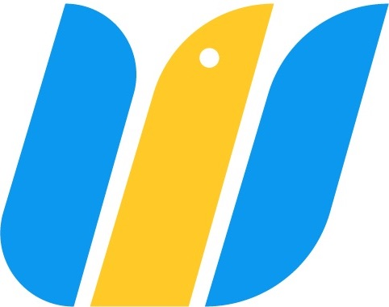
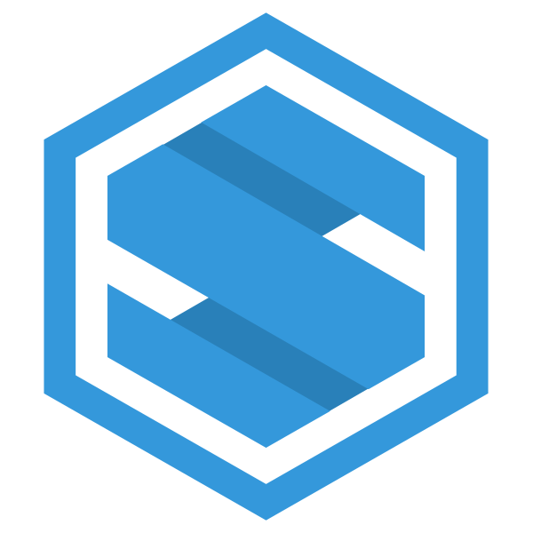

<Row>
<Col></Col>

<Col>

</Col>

<Col></Col>
</Row>

### CEO & Co-Founder of [WeSoarHigh](https://wesoarhigh.com)
_May 2020 - present_

#### About 
**[WeSoarHigh](https://wesoarhigh.com) simplifies the way businesses and startups hire pre-vetted Web and Mobile Developers they can trust**. We give people and businesses access to Technical resources that will help them succeed in the digital space. Our vision is to be the go-to platform for hiring freelance developers in the Philippines.

Straightforward process:
1. Request
1. Match
1. Hire

The struggle of when to compensate and what to expect has been a struggle between development and clients. At WeSoarHigh, we escrow the payment and ensure developers deliver before releasing client payment. A one-week trial is also provided entirely for FREE.

#### Roles and Responsibilities
As the CEO and co-founder of a budding startup, you'll need to wear many hats -- from doing building the platform and the company to acquiring developers and customers. I found some of the most essential responsibilities are creating a company culture that fosters trust and collaboration, operating in line with our mission and vision, and ensuring that all stakeholders' expectations are aligned.

---

<Row>
<Col></Col>

<Col>

</Col>

<Col></Col>
</Row>

### Co-Founder of [SevTech, Inc.](https://sevtechinc.com)
_Feb 2018 - present_

#### About
**We’re a B2B startup that delivers high-quality technology-based solutions to SME’s in the Philippines**. We help our clients establish their information systems that can bridge the gap between businesses and clients in our modern world.

#### Roles and Responsibilities
My co-founder and I are primarily responsible for customer acquisition and negotiations. We lead the development team, and develop, maintain, and test the systems we create for our clients.

---

### CodeBlink Tutorials
_November 2020 - present_

Inspired by her experience teaching React Native Mob

_More details coming soon. In the meantime, you can check out my_ [_LinkedIn profile_](https://www.linkedin.com/in/carmina-opada/)
